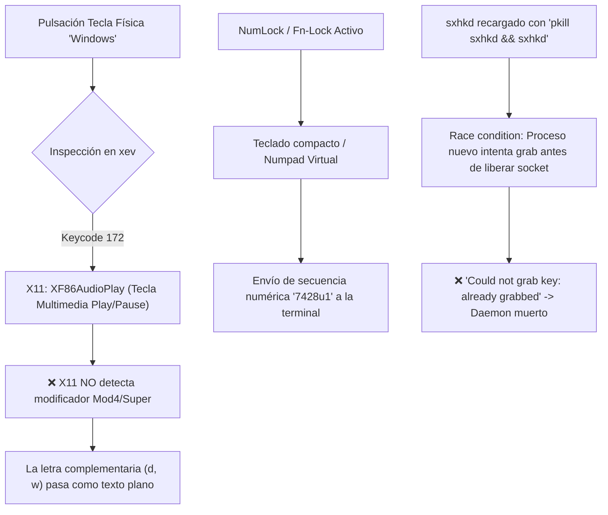

# 🛠️ Guía de Diagnóstico y Fix: Atajos de Teclado, Modificadores X11 y Rofi en BSPWM

[](https://parrotsec.org/)
[](https://github.com/baskerville/bspwm)
[](https://github.com/baskerville/sxhkd)
[](https://github.com/davatorium/rofi)

Documento técnico de análisis, depuración y resolución definitiva ante fallos en la captura de atajos de teclado (**sxhkd**), bloqueos silenciosos del lanzador (**Rofi**), colisiones de modificadores (**Super / Mod4**) y problemas de capas de hardware en laptops gaming (ej. **Acer Nitro 5 AN515-55**) y teclados inalámbricos multimedia (**Sharkoon / COM-5740**).

---

## 📋 Tabla de Contenidos

1. [Sintomatología y Problemas Detectados](#-sintomatología-y-problemas-detectados)
2. [Causas Raíz Identificadas (Root Cause Analysis)](#-causas-raíz-identificadas-root-cause-analysis)
3. [Metodología de Diagnóstico Paso a Paso](#-metodología-de-diagnóstico-paso-a-paso)
4. [Soluciones Implementadas](#-soluciones-implementadas)
   * [1. Remapeo de Tecla Super (Keycode 172 $\rightarrow$ Super_L)](#1-remapeo-de-tecla-super-keycode-172--super_l)
   * [2. Desactivación de Capa Virtual NumLock / Fn-Lock](#2-desactivación-de-capa-virtual-numlock--fn-lock)
   * [3. Limpieza de Stale Lockfiles en Rofi](#3-limpieza-de-stale-lockfiles-en-rofi)
   * [4. Recarga Idempotente de sxhkd sin Condiciones de Carrera](#4-recarga-idempotente-de-sxhkd-sin-condiciones-de-carrera)
   * [5. Expansión Numérica Explícita para Workspaces en BSPWM](#5-expansión-numérica-explícita-para-workspaces-en-bspwm)
5. [Configuración Final Lista para Producción](#-configuración-final-lista-para-producción)
6. [Cheat Sheet Definitivo de Atajos](#-cheat-sheet-definitivo-de-atajos)
7. [Checklist de Verificación Rápida](#-checklist-de-verificación-rápida)

---

## 🔍 Sintomatología y Problemas Detectados

Durante la operación diaria en entornos BSPWM, se presentaron los siguientes fallos críticos:
* **Fallo en combinaciones `Win + D` y `Win + W`:** Al presionar la tecla física de Windows con `D` o `W`, no se abría Rofi ni se cerraban ventanas; en su lugar, se imprimían caracteres aleatorios como `7428u`, `7428u1` o `s` / `w` sueltos en la terminal.
* **Polybar no se reiniciaba con `Win + Alt + R`:** Matar el proceso `sxhkd` dentro de scripts generaba condiciones de carrera perdiendo la captura de teclas en X11.
* **Workspaces inactivos:** Al pulsar `Win + Shift + [1-9]`, las ventanas no se movían al escritorio de destino.
* **Apertura gráfica funcional, pero bloqueo por teclado:** El ratón sí abría Rofi desde Polybar, demostrando que el problema no era gráfico sino de eventos de entrada X11.

---

## 🧬 Causas Raíz Identificadas (Root Cause Analysis)



### 1. Keycode 172 en lugar de Keycode 133
Mediante `xev` se capturó la señal física exacta emitida al pulsar la tecla Windows:
```text
KeyPress event ... keycode 172 (keysym 0x1008ff14, XF86AudioPlay)
KeyPress event ... keycode 25  (keysym 0x77, w)
```
La tecla física enviaba el evento **`XF86AudioPlay`** (código multimedia de reproducción). Al no ser un modificador (`Mod4`), el servidor X11 nunca activaba la máscara de atajos y enviaba la letra `w` como entrada de texto regular.

### 2. Capa Virtual NumLock / Fn-Lock
En portátiles Acer Nitro y teclados compactos como el Sharkoon COM-5740, tener **NumLock** habilitado convierte las teclas alfabéticas derechas en un bloque numérico virtual:
$$\text{U} \rightarrow 4, \quad \text{I} \rightarrow 5, \quad \text{J} \rightarrow 1, \quad \text{K} \rightarrow 2, \quad \text{L} \rightarrow 3$$
Esto causaba la inyección automática de la cadena `7428u` en la terminal interactiva.

### 3. Stale PID Lock en Rofi
Procesos previos interrumpidos dejaron un archivo bloqueador en `/run/user/1000/rofi.pid`. Rofi detectaba una supuesta instancia en ejecución y abortaba silenciosamente.

---

## 🛠️ Metodología de Diagnóstico Paso a Paso

Para diagnosticar problemas similares en cualquier máquina Linux:

### Paso 1: Captura de eventos con `xev`
```bash
# Ejecutar xev filtrado para aislar keycodes y keysyms limpios:
xev -event keyboard | grep -A2 --line-buffered '^KeyRelease' | sed -n '/keycode /s/^.*keycode \([0-9]*\).* (keysym \([^)]*\).*$/Keycode: \1 | Keysym: \2/p'
```

### Paso 2: Comprobar el estado de Modificadores en X11
```bash
xmodmap -pm
```
*Valida que `Super_L` esté presente en la fila `mod4` con sus códigos asociados.*

### Paso 3: Verificar estado de daemons y bloqueo de Rofi
```bash
# Verificar procesos activos
pgrep -a sxhkd; pgrep -a polybar

# Comprobar locks huérfanos
ls -la /run/user/$UID/rofi.pid /tmp/rofi* 2>/dev/null
```

---

## 💡 Soluciones Implementadas

### 1. Remapeo de Tecla Super (Keycode 172 $\rightarrow$ Super_L)
Se reasigna el código 172 al símbolo `Super_L` y se añade a la máscara `mod4`:

```bash
# Ejecución en caliente:
xmodmap -e "keycode 172 = Super_L NoSymbol Super_L" -e "add mod4 = Super_L"
```

**Persistencia en `~/.config/bspwm/bspwmrc`:**
```sh
# Mapeo de tecla Super para teclados multimedia / externos
xmodmap -e "keycode 172 = Super_L NoSymbol Super_L" -e "add mod4 = Super_L" 2>/dev/null &
```

---

### 2. Desactivación de Capa Virtual NumLock / Fn-Lock
Se anula el bloqueo numérico por software:

```bash
numlockx off
```

---

### 3. Limpieza de Stale Lockfiles en Rofi
```bash
rm -f /run/user/$UID/rofi.pid
```

---

### 4. Recarga Idempotente de `sxhkd` sin Condiciones de Carrera
En lugar de matar y levantar el binario bruscamente (`pkill sxhkd && sxhkd &`), se envía la señal nativa POSIX **`SIGUSR1`**, la cual instruye a `sxhkd` a releer su archivo de configuración sin soltar los *grabs* de X11:

```bash
pkill -USR1 -x sxhkd
```

---

### 5. Expansión Numérica Explícita para Workspaces en BSPWM
Se reemplazó la sintaxis ambigua `{1-9,0}` por listas explícitas de 10 elementos para evitar colisiones de *keysym* al usar modificadores `Shift`:

```sxhkdrc
# Enfocar escritorio
super + {1,2,3,4,5,6,7,8,9,0}
    bspc desktop -f '^{1,2,3,4,5,6,7,8,9,10}'

# Mover ventana enfocada a escritorio y seguir foco
super + shift + {1,2,3,4,5,6,7,8,9,0}
    bspc node -d '^{1,2,3,4,5,6,7,8,9,10}' --follow

# Mover ventana en segundo plano (permanecer en pantalla actual)
super + ctrl + shift + {1,2,3,4,5,6,7,8,9,0}
    bspc node -d '^{1,2,3,4,5,6,7,8,9,10}'
```

---

## 🚀 Configuración Final Lista para Producción

### Archivo: `~/.config/bspwm/bspwmrc`

```sh
#! /bin/sh

# ==========================================
# 1. ENTORNO Y FIXES
# ==========================================
wmname LG3D &
xsetroot -cursor_name left_ptr &

# Fix: Remapeo persistente de tecla Super (Keycode 172)
xmodmap -e "keycode 172 = Super_L NoSymbol Super_L" -e "add mod4 = Super_L" 2>/dev/null &

# ==========================================
# 2. CONFIGURACIÓN BSPWM
# ==========================================
bspc monitor -d I II III IV V VI VII VIII IX X

bspc config border_width        2  
bspc config window_gap         12
bspc config split_ratio         0.52
bspc config borderless_monocle  true
bspc config gapless_monocle     true
bspc config focus_follows_pointer true
bspc config normal_border_color "#4c566a"
bspc config active_border_color "#88c0d0"
bspc config focused_border_color "#81a1c1"

# Reglas de Pentesting y Aplicaciones
bspc rule -a BurpSuite desktop='^10' state=tiled follow=on
bspc rule -a Firefox desktop='^2'
bspc rule -a Gimp state=floating follow=on
bspc rule -a mpv state=floating
bspc rule -a Screenkey manage=off

# ==========================================
# 3. AUTOARRANQUE (Idempotente)
# ==========================================
if pgrep -x sxhkd >/dev/null; then
    pkill -USR1 -x sxhkd
else
    sxhkd -c "$HOME/.config/sxhkd/sxhkdrc" &
fi

if ! pgrep -x picom >/dev/null; then
    picom --config ~/.config/picom/picom.conf -b
fi

if ! pgrep -x lxpolkit >/dev/null; then
    lxpolkit &
fi

# ==========================================
# 4. HARDWARE E INTERFAZ
# ==========================================
TOUCHPAD_ID=$(xinput list --name-only | grep -i "touchpad")
if [ -n "$TOUCHPAD_ID" ]; then
    xinput set-prop "$TOUCHPAD_ID" "libinput Tapping Enabled" 1
fi

[ -f ~/Wallpaper/rodrigo47363.png ] && feh --bg-fill ~/Wallpaper/rodrigo47363.png &
$HOME/.config/polybar/launch.sh &
```

---

## ⌨️ Cheat Sheet Definitivo de Atajos

### 🗔 Ventanas y Workspaces
| Atajo | Acción |
| :--- | :--- |
| <kbd>Win</kbd> + <kbd>W</kbd> | Cerrar ventana actual (`bspc node -c`) |
| <kbd>Win</kbd> + <kbd>Shift</kbd> + <kbd>W</kbd> | Forzar cierre (Kill) de ventana (`bspc node -k`) |
| <kbd>Win</kbd> + <kbd>1-9, 0</kbd> | Cambiar al Workspace (1 al 10) |
| <kbd>Win</kbd> + <kbd>Shift</kbd> + <kbd>1-9, 0</kbd> | **Mover ventana al Workspace y seguir el foco** |
| <kbd>Win</kbd> + <kbd>Ctrl</kbd> + <kbd>Shift</kbd> + <kbd>1-9, 0</kbd> | Mover ventana en segundo plano |
| <kbd>Win</kbd> + <kbd>F</kbd> / <kbd>S</kbd> / <kbd>T</kbd> | Alternar Fullscreen / Flotante / Mosaico |

### 🚀 Lanzadores y Terminal
| Atajo | Acción |
| :--- | :--- |
| <kbd>Win</kbd> + <kbd>D</kbd> o <kbd>Win</kbd> + <kbd>Espacio</kbd> | Lanzador de aplicaciones Rofi (`drun`) |
| <kbd>Win</kbd> + <kbd>R</kbd> | Rofi modo comandos (`run`) |
| <kbd>Win</kbd> + <kbd>Tab</kbd> | Conmutador de ventanas activas (`window`) |
| <kbd>Win</kbd> + <kbd>Shift</kbd> + <kbd>Espacio</kbd> | Rofi modo combinado (`combi`) |
| <kbd>Win</kbd> + <kbd>Enter</kbd> | Terminal Kitty principal |
| <kbd>Win</kbd> + <kbd>Shift</kbd> + <kbd>Enter</kbd> | Terminal Kitty flotante |

### 📊 Control del Sistema y Barras
| Atajo | Acción |
| :--- | :--- |
| <kbd>Win</kbd> + <kbd>Alt</kbd> + <kbd>R</kbd> | **Reiniciar la Polybar** (`launch.sh`) |
| <kbd>Win</kbd> + <kbd>Esc</kbd> | Recargar configuración de `sxhkd` al vuelo (`SIGUSR1`) |
| <kbd>Win</kbd> + <kbd>Shift</kbd> + <kbd>Esc</kbd> | Kill-switch de emergencia (procesos GUI colgados) |
| <kbd>Win</kbd> + <kbd>Alt</kbd> + <kbd>P</kbd> / <kbd>E</kbd> / <kbd>S</kbd> | Pomodoro: Play-Pausa / Finalizar bloque / Detener |

---

## 📋 Checklist de Verificación Rápida

1. [x] **Comprobar mod4:** `xmodmap -pm | grep Super_L` debe incluir `0x85` y `0xac` (172).
2. [x] **Comprobar sxhkd activo:** `pgrep -a sxhkd` reportando PID saludable.
3. [x] **Comprobar Polybar activa:** `pgrep -a polybar` con soporte IPC.
4. [x] **Test de apertura:** Pulsar `Win + D` abre Rofi centrado.
5. [x] **Test de cierre:** Pulsar `Win + W` cierra la ventana enfocada.
6. [x] **Test de recarga:** Pulsar `Win + Alt + R` reinicia la Polybar de forma fluida.

---

> 👤 **Autor:** Rodrigo Villegas ([@rodrigo47363](https://github.com/rodrigo47363))  
> 🛡️ *Hacking Ético, Seguridad Ofensiva y Optimización de Entornos Linux.*
