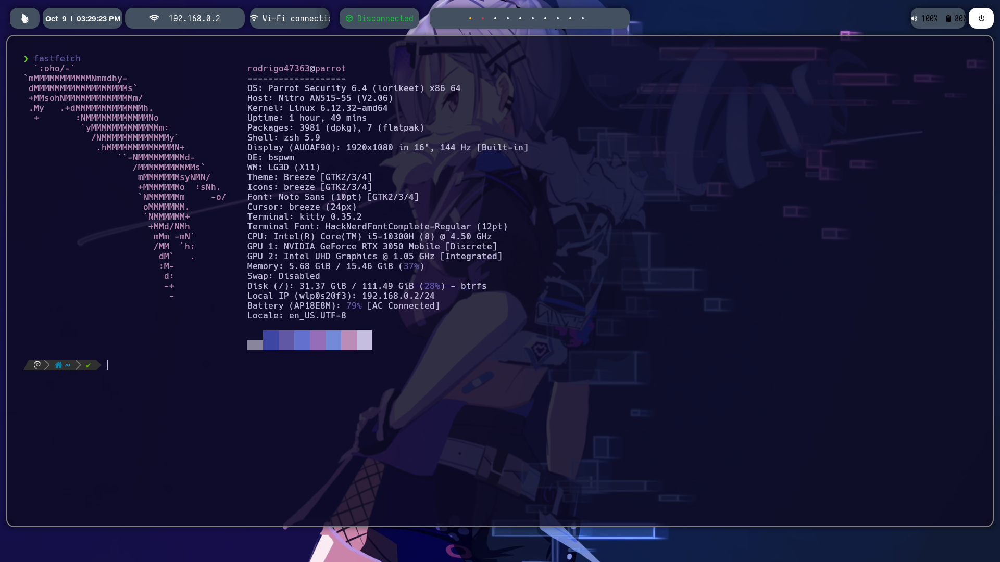

# ⚙️ Dotfiles — Cross-Platform Dev Environment
### 💻 Advanced setup for Linux & Windows


---

## 🧩 Description

Personal dotfiles repository to **customize, automate, and optimize** development and pentesting environments across **Linux and Windows**.  
Includes configurations and helper scripts for **Zsh, PowerShell, Polybar, Rofi, BSPWM**, and common productivity / pentest utilities.  
This repo prioritizes recent configs (use the newest file when multiple versions exist) and provides a modular `bootstrap.sh` for safe installation.

---

## 📌 Quick start

```bash
# Clone
git clone https://github.com/rodrigo47363/dotfiles.git ~/dotfiles
cd ~/dotfiles

# Minimal bootstrap (creates symlinks, prioritizes latest versions)
chmod +x bootstrap.sh || true
./bootstrap.sh --minimal
```

---

## 📁 Repository structure

```
.
├── .zshrc                                # Main Zsh configuration (most recent)
├── .zshrc_autocd                         # Auto-cd helper module
├── sxhkdrc                               # sxhkd / BSPWM keybindings
├── powermenu_alt.rasi                    # Rofi theme for power menu
├── launch.sh                             # Launcher / startup script (Polybar, Rofi)
├── ethernet_status.sh                    # Ethernet status helper (for Polybar)
├── 12Hourscurrent.ini                    # Polybar layout (12-hour clock)
├── "FIx baterry and volume 12 hourscurrent.ini" # Polybar fix for battery & volume
├── current.ini / current2.ini            # Other Polybar variants (older)
├── Microsoft.PowerShell_profile.ps1      # PowerShell profile for Windows
├── bootstrap.sh                          # Installer / symlinker (recommended)
└── dotfiles_backup.rar                   # Backup archive (REVIEW: may contain sensitive data)
└── 📁poolybar
└── 📁rofi 
```

**Note:** When multiple files share a base name (e.g., `current*.ini` or `.zshrc` variants), prefer the **most recently updated** file. Use symlinks like `current.active.ini` to mark the active config.

---

## 🧰 Dependencies

> Debian/Ubuntu/Parrot/Kali example:

```bash
sudo apt update && sudo apt install -y \
  git curl wget zsh unzip php build-essential ruby rofi kitty \
  aircrack-ng airgeddon cmake pkg-config python3-sphinx \
  libcairo2-dev libxcb1-dev libxcb-util0-dev libxcb-ewmh-dev \
  libxcb-randr0-dev libxcb-composite0-dev python3-xcbgen xcb-proto \
  libxcb-image0-dev libxcb-icccm4-dev libxcb-xkb-dev libxcb-xrm-dev \
  libxcb-cursor-dev libasound2-dev libpulse-dev libjsoncpp-dev \
  libmpdclient-dev libuv1-dev libnl-genl-3-dev meson picom \
  libxext-dev libxcb-damage0-dev libxcb-xfixes0-dev libxcb-render-util0-dev \
  libxcb-render0-dev libxcb-present-dev libxcb-xinerama0-dev libpixman-1-dev \
  libdbus-1-dev libconfig-dev libgl1-mesa-dev libpcre2-dev libevdev-dev \
  uthash-dev libev-dev libx11-xcb-dev libxcb-glx0-dev libpcre3 libpcre3-dev \
  feh scrot scrub xclip bat locate ranger neofetch wmname acpi bspwm sxhkd \
  imagemagick cmatrix zsh-syntax-highlighting zsh-autosuggestions texlive-latex-recommended \
  hcxdumptool hcxtools lsd fastfetch neovim tmux || { echo "Install failed"; exit 1; }
```

* `texlive-full` is heavy — prefer `texlive-latex-recommended` unless you need full TeX.
* Some utilities (`lsd`, `bat`, `exa`, `fastfetch`) may need installation from releases/AUR or GitHub if not in your distro repo.

---

## 🚀 Installation & basic usage

**Symlink examples**

```bash
# Zsh
ln -sf ~/dotfiles/.zshrc ~/.zshrc
[ -f ~/dotfiles/.zshrc_autocd ] && ln -sf ~/dotfiles/.zshrc_autocd ~/.zsh/.zshrc_autocd

# sxhkd
mkdir -p ~/.config/sxhkd
ln -sf ~/dotfiles/sxhkdrc ~/.config/sxhkd/sxhkdrc

# Polybar (bootstrap sets the correct current.ini)
mkdir -p ~/.config/polybar
ln -sf ~/dotfiles/current.active.ini ~/.config/polybar/current.ini
```

**Manually switch Polybar config (example)**

```bash
cp ~/.config/polybar/current.ini ~/.config/polybar/current.ini.bak.$(date +%Y%m%d%H%M)
cp ~/dotfiles/12Hourscurrent.ini ~/.config/polybar/current.ini
polybar-msg cmd restart
```

---

## 🔒 Security note

* **Do not** keep secrets, private keys, or credentials committed in the repo.
* Review `dotfiles_backup.rar` before publishing — it may contain sensitive data.
* Add a `SECURITY.md` and enable secret scanning in CI (e.g., `git-secrets`, `trufflehog`) for safety.

---

## 🎨 Features

* Custom, modular configurations for **Zsh**, **Polybar**, **Rofi**, **BSPWM**.
* Launchers & automation (`launch.sh`, `bootstrap.sh`) to standardize setups.
* Keybindings via `sxhkd`, Polybar layouts (12h / fixes), and ethernet status helper.
* Cross-platform support: Linux (Parrot, Debian, Arch) and Windows (PowerShell 7+).
* Focused on productivity, minimalism and pentesting workflows.

---

## 🧠 Pro tip

Before applying: back up current config:

```bash
tar -czvf ~/backup_old_dotfiles.tar.gz ~/.zshrc ~/.config/polybar ~/.config/bspwm
```

---

## 👤 Author

**Rodrigo Vil** — Ethical Hacker & Pentester | Red Team & Bug Bounty Researcher

* Focus: Offensive security, automation, custom Linux environments
* OS: Parrot Security OS | Shell: Zsh | Editor: Neovim
* GitHub: `https://github.com/rodrigo47363`

---

## 📜 License

MIT License — free for personal and professional use, attribution appreciated.

---

> ⚡ *"Customize everything. Automate what you can. Hack ethically."*  
> — Rodrigo Vil

---

---

# ⚙️ Dotfiles — Entorno Multiplataforma
### 💻 Configuración avanzada para Linux y Windows


---

## 🧩 Descripción

Repositorio de dotfiles personales para **optimizar, automatizar y estandarizar** entornos de desarrollo y pentesting en **Linux y Windows**.  
Incluye configuraciones y scripts para **Zsh, PowerShell, Polybar, Rofi, BSPWM**, y utilidades comunes de productividad y auditoría.  
Este repo prioriza las configuraciones más recientes y ofrece un `bootstrap.sh` modular para instalación segura.

---

## 📌 Inicio rápido

```bash
# Clonar
git clone https://github.com/rodrigo47363/dotfiles.git ~/dotfiles
cd ~/dotfiles

# Bootstrap mínimo (crea symlinks y prioriza las versiones recientes)
chmod +x bootstrap.sh || true
./bootstrap.sh --minimal
```

---

## 📁 Estructura del repositorio

```
.
├── .zshrc                                # Configuración principal de Zsh (más reciente)
├── .zshrc_autocd                         # Módulo helper auto-cd
├── sxhkdrc                               # Keybindings sxhkd / BSPWM
├── powermenu_alt.rasi                    # Tema Rofi para menú de energía
├── launch.sh                             # Script de arranque (Polybar, Rofi)
├── ethernet_status.sh                    # Script de estado Ethernet (para Polybar)
├── 12Hourscurrent.ini                    # Layout Polybar (formato 12h)
├── "FIx baterry and volume 12 hourscurrent.ini" # Fix Polybar bateria / volumen
├── current.ini / current2.ini            # Variantes Polybar (más antiguas)
├── Microsoft.PowerShell_profile.ps1      # Perfil PowerShell para Windows
├── bootstrap.sh                          # Instalador / creador de symlinks (recomendado)
└── dotfiles_backup.rar                   # Backup completo (REVISAR: datos sensibles)
```

**Nota:** Cuando existan múltiples versiones del mismo archivo (por ejemplo `current*.ini` o variantes de `.zshrc`), usa la **versión más reciente** o marca la activa con un symlink `current.active.ini`.

---

## 🧰 Dependencias

> Ejemplo Debian/Ubuntu/Parrot/Kali:

```bash
sudo apt update && sudo apt install -y \
  git curl wget zsh unzip php build-essential ruby rofi kitty \
  aircrack-ng airgeddon cmake pkg-config python3-sphinx \
  libcairo2-dev libxcb1-dev libxcb-util0-dev libxcb-ewmh-dev \
  libxcb-randr0-dev libxcb-composite0-dev python3-xcbgen xcb-proto \
  libxcb-image0-dev libxcb-icccm4-dev libxcb-xkb-dev libxcb-xrm-dev \
  libxcb-cursor-dev libasound2-dev libpulse-dev libjsoncpp-dev \
  libmpdclient-dev libuv1-dev libnl-genl-3-dev meson picom \
  libxext-dev libxcb-damage0-dev libxcb-xfixes0-dev libxcb-render-util0-dev \
  libxcb-render0-dev libxcb-present-dev libxcb-xinerama0-dev libpixman-1-dev \
  libdbus-1-dev libconfig-dev libgl1-mesa-dev libpcre2-dev libevdev-dev \
  uthash-dev libev-dev libx11-xcb-dev libxcb-glx0-dev libpcre3 libpcre3-dev \
  feh scrot scrub xclip bat locate ranger neofetch wmname acpi bspwm sxhkd \
  imagemagick cmatrix zsh-syntax-highlighting zsh-autosuggestions texlive-latex-recommended \
  hcxdumptool hcxtools lsd fastfetch neovim tmux || { echo "Instalación fallida"; exit 1; }
```

* `texlive-full` ocupa mucho espacio — usa `texlive-latex-recommended` a menos que necesites todo TeX.
* Utilidades como `lsd`, `bat`, `exa`, `fastfetch` pueden requerir instalación desde releases/AUR o GitHub si no están en tu repo.

---

## 🚀 Instalación & uso básico

**Ejemplos de symlink**

```bash
# Zsh
ln -sf ~/dotfiles/.zshrc ~/.zshrc
[ -f ~/dotfiles/.zshrc_autocd ] && ln -sf ~/dotfiles/.zshrc_autocd ~/.zsh/.zshrc_autocd

# sxhkd
mkdir -p ~/.config/sxhkd
ln -sf ~/dotfiles/sxhkdrc ~/.config/sxhkd/sxhkdrc

# Polybar (bootstrap elige el current correcto)
mkdir -p ~/.config/polybar
ln -sf ~/dotfiles/current.active.ini ~/.config/polybar/current.ini
```

**Cambiar Polybar manualmente (ejemplo)**

```bash
cp ~/.config/polybar/current.ini ~/.config/polybar/current.ini.bak.$(date +%Y%m%d%H%M)
cp ~/dotfiles/12Hourscurrent.ini ~/.config/polybar/current.ini
polybar-msg cmd restart
```

---

## 🔒 Notas de seguridad

* **No** mantengas secretos, claves privadas o credenciales en el repo.
* Revisa `dotfiles_backup.rar` antes de publicar — podría contener datos sensibles.
* Añade `SECURITY.md` y activa escaneo de secretos en CI (`git-secrets`, `trufflehog`) si es posible.

---

## 🎨 Características

* Configs modulares para **Zsh**, **Polybar**, **Rofi**, **BSPWM**.
* Scripts y launchers (`launch.sh`, `bootstrap.sh`) para estandarizar entornos.
* Keybindings con `sxhkd`, layouts Polybar (12h / fixes), helper de Ethernet.
* Soporte multiplataforma: Linux (Parrot, Debian, Arch) y Windows (PowerShell 7+).
* Enfoque en productividad, minimalismo y flujo de trabajo pentesting.

---

## 🧠 Consejo

Antes de aplicar cambios: realiza un backup de tu configuración actual:

```bash
tar -czvf ~/backup_old_dotfiles.tar.gz ~/.zshrc ~/.config/polybar ~/.config/bspwm
```

---

## 👤 Autor

**Rodrigo Vil** — Ethical Hacker & Pentester | Red Team & Bug Bounty Researcher

* Enfoque: seguridad ofensiva, automatización y entornos Linux personalizados
* OS: Parrot Security OS | Shell: Zsh | Editor: Neovim
* GitHub: `https://github.com/rodrigo47363`

---

## 📜 Licencia

MIT License — libre para uso personal y profesional; se agradece atribución.

---

> ⚡ *"Personaliza todo. Automatiza lo posible. Hackea éticamente."*  
> — Rodrigo Vil
