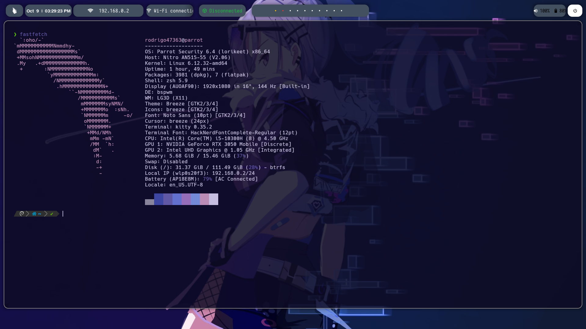

# ⚙️ Dotfiles — Entorno de Desarrollo y Pentesting (Cross-Platform)



[](https://opensource.org/licenses/MIT)
[](https://parrotsec.org/)
[]()

## 🧩 Descripción

Repositorio personal diseñado para **personalizar, automatizar y optimizar** entornos de seguridad ofensiva y desarrollo multiplataforma. 
Construido y auditado para distribuciones orientadas al pentesting (Parrot OS / Kali Linux) usando **BSPWM, Sxhkd, Polybar y Rofi**, e incluye perfiles optimizados para PowerShell en Windows.

Este entorno prioriza la eficiencia, el uso de atajos de teclado y la automatización de tareas que no agregan valor analítico en auditorías.

---

## 🛡️ OPSEC y Seguridad del Repositorio

Como profesional de la seguridad, la protección de credenciales es primordial. 
* **Regla Zero-Trust:** Asegúrate de no incluir claves privadas, tokens de API, historiales de Bash (`.bash_history`) o archivos `.rar` con información personal en los commits.
* Si clonas este repositorio, utiliza un `.gitignore` robusto para excluir archivos de volcado o copias de seguridad locales (ej. `echo "*.rar" >> .gitignore`).

---

## 🚀 Inicio Rápido

El repositorio cuenta con un script de arranque seguro (`bootstrap.sh`) que genera los enlaces simbólicos (symlinks) necesarios sin destruir tus configuraciones previas de forma inadvertida.

```bash
# 1. Clonar el repositorio
git clone [https://github.com/rodrigo47363/dotfiles.git](https://github.com/rodrigo47363/dotfiles.git) ~/dotfiles
cd ~/dotfiles

# 2. Asignar permisos de ejecución e instalar
chmod +x bootstrap.sh
./bootstrap.sh --minimal
````

-----

## 🧰 Dependencias del Entorno (Debian/Parrot/Kali)

Para replicar el entorno al 100%, instala los siguientes paquetes base y herramientas de auditoría. *(Nota: Algunas herramientas modernas como `fastfetch` pueden requerir instalación vía GitHub Releases si tu repositorio APT está desactualizado).*

```bash
sudo apt update && sudo apt install -y \
  git curl wget zsh unzip php build-essential ruby rofi kitty \
  aircrack-ng airgeddon cmake pkg-config python3-sphinx \
  libcairo2-dev libxcb1-dev libxcb-util0-dev libxcb-ewmh-dev \
  libxcb-randr0-dev libxcb-composite0-dev python3-xcbgen xcb-proto \
  libxcb-image0-dev libxcb-icccm4-dev libxcb-xkb-dev libxcb-xrm-dev \
  libxcb-cursor-dev libasound2-dev libpulse-dev libjsoncpp-dev \
  libmpdclient-dev libuv1-dev libnl-genl-3-dev meson picom \
  feh scrot scrub xclip bat locate ranger wmname acpi bspwm sxhkd \
  imagemagick cmatrix zsh-syntax-highlighting zsh-autosuggestions \
  texlive-latex-recommended hcxdumptool hcxtools neovim tmux brightnessctl
```

-----

## 🎨 Selector Dinámico de Temas (Rofi)

Este entorno incluye un script avanzado en Bash (`theme-selector.sh`) que inyecta configuraciones de Rofi al vuelo utilizando `sed`, evitando la corrupción de archivos y manteniendo la persistencia de los temas.

### Requisitos y Despliegue

Para que el script de inyección funcione, la estructura de directorios en tu sistema local debe ser exacta.

**1. Inicializar la infraestructura (Si es una máquina nueva):**

```bash
mkdir -p ~/.config/rofi/themes
touch ~/.config/rofi/config.rasi
```

**2. Desplegar los archivos desde el repositorio:**
Copia los temas preservando sus atributos y permisos originales (`-p`):

```bash
cp -vp ~/dotfiles/rofi/*.rofi ~/.config/rofi/themes/
cp -vp ~/dotfiles/rofi/*.rasi ~/.config/rofi/themes/
```

**3. Ejecución:**

```bash
chmod +x ~/.config/rofi/themes/theme-selector.sh
~/.config/rofi/themes/theme-selector.sh
```

> **⚠️ Advertencia de Privilegios:** **NUNCA** ejecutes el selector de temas utilizando `sudo`. Modificar configuraciones de interfaz gráfica con privilegios elevados reasignará los inodos al superusuario, bloqueando el acceso de tu usuario estándar y corrompiendo la configuración de Rofi (Denegación de Servicio Local).

-----

## 🔧 Fixes de Hardware (Touchpad)

En ciertos equipos portátiles (ej. Acer Nitro), el entorno BSPWM no levanta la configuración de *Tap-to-click* por defecto. Puedes solucionarlo inyectando esto en tu script de inicio (`bspwmrc`):

```bash
# Habilita el 'clic por toque'. 
# IMPORTANTE: Verifica el ID de tu touchpad usando el comando 'xinput list' (ej. ID 15)
xinput set-prop 15 "libinput Tapping Enabled" 1
```

-----

## 📁 Estructura del Repositorio

Se prioriza el uso de configuraciones modulares. Si existen múltiples versiones de un layout (ej. `current.ini`), el `bootstrap.sh` enlazará automáticamente la iteración más reciente.

```text
.
├── .zshrc                        # Configuración principal de Zsh y alias ofensivos
├── sxhkdrc                       # Mapeo de atajos de teclado (Sxhkd / BSPWM)
├── rofi/                         # Entorno de Rofi
│   ├── theme-selector.sh         # Script inyector de configuración dinámica
│   ├── powermenu_alt.rasi        # UI del menú de apagado
│   └── themes/                   # Colección de archivos .rofi y .rasi
├── polybar/                      # Entorno de Polybar
│   ├── launch.sh                 # Script de arranque
│   ├── ethernet_status.sh        # Módulo de auditoría de red
│   └── layouts/                  # Variantes de visualización (12H / 24H)
├── powershell/                   # Perfiles unificados para entornos Windows
└── bootstrap.sh                  # Motor de instalación y symlinks
```

-----

## 👤 Autor & Licencia

**Rodrigo Vil** — Ethical Hacker | Pentester | Red Team Specialist

  * **Enfoque:** Seguridad ofensiva, auditorías de red (wireless security), bug bounty y automatización.
  * **GitHub:** [rodrigo47363](https://github.com/rodrigo47363)

[](https://opensource.org/licenses/MIT)
*Libre para uso personal, profesional y modificación bajo la Licencia MIT.*

> ⚡ *"Customize everything. Automate what you can. Hack ethically."*
