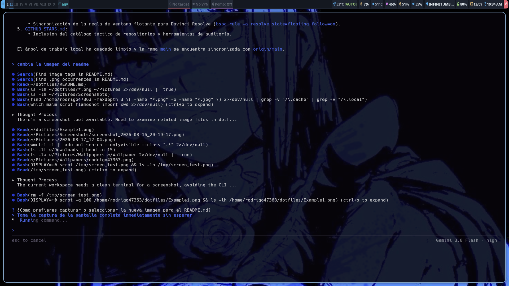

# ⚙️ Dotfiles — Entorno de Desarrollo y Pentesting (Cross-Platform)



[](https://opensource.org/licenses/MIT)
[](https://parrotsec.org/)
[](https://github.com/rodrigo47363/dotfiles)

## 🧩 Descripción

Repositorio personal diseñado para **personalizar, automatizar y optimizar** entornos de seguridad ofensiva y desarrollo multiplataforma. 
Construido y auditado para distribuciones orientadas al pentesting (Parrot OS / Kali Linux) usando **BSPWM, Sxhkd, Polybar y Rofi**, e incluye perfiles optimizados para PowerShell en Windows.

Este entorno prioriza la eficiencia, el uso de atajos de teclado, la productividad con temporizador Pomodoro integrado y la automatización de tareas en auditorías y laboratorios (HTB / THM).

---

## 🛡️ OPSEC y Seguridad del Repositorio

Como profesional de la seguridad, la protección de credenciales es primordial:
* **Regla Zero-Trust:** Asegúrate de no incluir claves privadas, tokens de API, historiales de Bash (`.bash_history`) o archivos comprimidos con información personal en los commits.
* Si clonas este repositorio, utiliza un `.gitignore` robusto para excluir archivos de volcado o copias de seguridad locales.

---

## 🚀 Inicio Rápido

El repositorio cuenta con scripts y configuraciones modulares listas para desplegarse:

```bash
# 1. Clonar el repositorio
git clone https://github.com/rodrigo47363/dotfiles.git ~/dotfiles
cd ~/dotfiles

# 2. Desplegar configuraciones a ~/.config
mkdir -p ~/.config/{bspwm/scripts,sxhkd,polybar,rofi}
cp -r polybar/* ~/.config/polybar/
cp -r rofi/* ~/.config/rofi/
cp sxhkdrc ~/.config/sxhkd/sxhkdrc
cp bspwmrc ~/.config/bspwm/bspwmrc
cp bspwm_resize ~/.config/bspwm/scripts/bspwm_resize
chmod +x ~/.config/bspwm/bspwmrc ~/.config/bspwm/scripts/* ~/.config/polybar/launch.sh ~/.config/polybar/scripts/*
```

---

## 🧰 Dependencias del Entorno (Debian/Parrot/Kali)

Para replicar el entorno al 100%, instala los siguientes paquetes base y utilidades:

```bash
sudo apt update -y && sudo apt install -y \
    xinput git curl wget zsh unzip build-essential cmake pkg-config meson \
    kitty tmux neovim jq bat locate ranger xclip scrub acpi brightnessctl wmname \
    bspwm sxhkd rofi picom feh scrot imagemagick \
    polybar pamixer network-manager \
    libcairo2-dev libxcb1-dev libxcb-util0-dev libxcb-ewmh-dev \
    libxcb-randr0-dev libxcb-composite0-dev python3-xcbgen xcb-proto \
    libxcb-image0-dev libxcb-icccm4-dev libxcb-xkb-dev libxcb-xrm-dev \
    libxcb-cursor-dev libasound2-dev libpulse-dev libjsoncpp-dev \
    libmpdclient-dev libuv1-dev libnl-genl-3-dev \
    openvpn aircrack-ng airgeddon hcxdumptool hcxtools \
    zsh-syntax-highlighting zsh-autosuggestions \
    cmatrix nmcli golang seclists wordlists \
    && sudo updatedb
```

---

## ⌨️ Atajos de Teclado Clave (`sxhkdrc`)

El archivo [`sxhkdrc`](sxhkdrc) gestiona todas las combinaciones de teclas del entorno.

> 📖 **Guía de Diagnóstico y Fix:** Consulta el documento especializado [`KEYBOARD_AND_SHORTCUTS_TROUBLESHOOTING.md`](KEYBOARD_AND_SHORTCUTS_TROUBLESHOOTING.md) para la resolución de eventos X11, remapeo de tecla Super y fix de hardware.

| Combinación | Acción |
|---|---|
| <kbd>Super</kbd> / <kbd>Alt</kbd> + <kbd>Enter</kbd> | Abrir terminal Kitty principal |
| <kbd>Super</kbd> + <kbd>Shift</kbd> + <kbd>Enter</kbd> | Abrir terminal Kitty flotante |
| <kbd>Super</kbd> / <kbd>Alt</kbd> + <kbd>D</kbd> o <kbd>Espacio</kbd> | Lanzador de aplicaciones Rofi (`drun`) |
| <kbd>Super</kbd> + <kbd>R</kbd> | Modo comandos Rofi (`run`) |
| <kbd>Super</kbd> / <kbd>Alt</kbd> + <kbd>Tab</kbd> | Conmutador de ventanas Rofi (`window`) |
| <kbd>Super</kbd> + <kbd>Shift</kbd> + <kbd>Espacio</kbd> | Lanzador combinado Rofi (`combi`) |
| <kbd>Super</kbd> + <kbd>W</kbd> / <kbd>Shift</kbd> + <kbd>W</kbd> | Cerrar ventana actual / Matar proceso de ventana |
| <kbd>Super</kbd> + <kbd>1-9, 0</kbd> | Cambiar al Workspace (1 al 10) |
| <kbd>Super</kbd> + <kbd>Shift</kbd> + <kbd>1-9, 0</kbd> | **Mover ventana enfocada al Workspace y seguir el foco** |
| <kbd>Super</kbd> + <kbd>Ctrl</kbd> + <kbd>Shift</kbd> + <kbd>1-9, 0</kbd> | Mover ventana enfocada al Workspace en segundo plano |
| <kbd>Super</kbd> + <kbd>Alt</kbd> + <kbd>R</kbd> | **Reiniciar la barra Polybar** (`launch.sh`) |
| <kbd>Super</kbd> + <kbd>Esc</kbd> | Recargar configuración de `sxhkd` al vuelo (`SIGUSR1`) |
| <kbd>Super</kbd> + <kbd>Shift</kbd> + <kbd>Esc</kbd> | Kill-switch de emergencia para procesos GUI bloqueados |
| **🍅 Pomodoro (Pomoc)** | |
| <kbd>Super</kbd> + <kbd>Alt</kbd> + <kbd>P</kbd> | Iniciar / Alternar Pausa-Reanudar |
| <kbd>Super</kbd> + <kbd>Alt</kbd> + <kbd>E</kbd> | Finalizar bloque de enfoque / Saltar a descanso |
| <kbd>Super</kbd> + <kbd>Alt</kbd> + <kbd>S</kbd> | Detener temporizador Pomodoro |
| **🔊 Control de Audio & Brillo** | |
| <kbd>Super</kbd> + <kbd>↑</kbd> / <kbd>↓</kbd> | Subir / Bajar volumen (+5% / -5%) |
| <kbd>Super</kbd> + <kbd>Shift</kbd> + <kbd>M</kbd> | Mutear / Desmutear audio |
| <kbd>Brillo Teclas</kbd> | Ajuste automático vía `brightnessctl` |

---

## 📊 Polybar — Módulos Ofensivos y Productividad

La barra está configurada con distribución modular en tres secciones:

```ini
modules-left = launcher bspwm xwindow
modules-center = target vpn pomodoro
modules-right = filesystem cpu temperature gpu memory backlight pulseaudio wlan eth battery date powermenu systray
```

### 🔴 Módulos Centrales Especiales:

1. **🎯 Target (`target.sh`)**:
   - Muestra el objetivo activo de la máquina en auditoría.
   - Click izquierdo para copiar IP al portapapeles.
   - Click derecho para limpiar el objetivo.

2. **🛡️ VPN Detector (`vpn.sh`)**:
   - Detecta automáticamente conexiones OpenVPN activas (`tun0`, `tap0`).
   - Identifica y colorea dinámicamente si la conexión pertenece a **Hack The Box (HTB)** o **TryHackMe (THM)**.
   - Soporta copia rápida de IP al portapapeles.

3. **🍅 Pomodoro Timer (`pomodoro.sh` / `pomoc`)**:
   - Integración nativa con el demonio ultraligero [`pomoc`](https://github.com/dream-wa1ker/pomoc) basado en sockets UNIX.
   - **Click Izquierdo**: Iniciar / Pausar / Reanudar sesión.
   - **Click Derecho**: Terminar sesión actual y activar descanso.
   - **Click Central**: Detener demonio.

---

## 🎨 Selector Dinámico de Temas (Rofi)

Este entorno incluye un script avanzado en Bash (`theme-selector.sh`) que inyecta configuraciones de Rofi al vuelo utilizando `sed`, evitando la corrupción de archivos y manteniendo la persistencia de los temas.

```bash
# Ejecución del selector de temas
~/.config/rofi/themes/theme-selector.sh
```

> **⚠️ Advertencia de Privilegios:** **NUNCA** ejecutes el selector de temas utilizando `sudo`. Modificar configuraciones de interfaz gráfica con privilegios elevados reasignará los inodos al superusuario, bloqueando el acceso de tu usuario estándar.

---

## 🔧 Fixes de Hardware (Touchpad)

En ciertos equipos portátiles (ej. Acer Nitro), el entorno BSPWM no levanta la configuración de *Tap-to-click* por defecto. El script `bspwmrc` incluye la detección y activación automática:

```bash
TOUCHPAD_ID=$(xinput list --name-only | grep -i "touchpad")
if [ -n "$TOUCHPAD_ID" ]; then
    xinput set-prop "$TOUCHPAD_ID" "libinput Tapping Enabled" 1
fi
```

---

## 📁 Estructura del Repositorio

```text
.
├── bspwmrc                              # Script de inicialización y reglas de ventanas (BSPWM)
├── sxhkdrc                              # Mapeo de atajos de teclado y hotkeys
├── bspwm_resize                         # Script para redimensionar ventanas en mosaico
├── KEYBOARD_AND_SHORTCUTS_TROUBLESHOOTING.md # Guía técnica de diagnóstico y fix X11
├── polybar/                             # Entorno y módulos de Polybar
│   ├── config.ini                       # Configuración principal de la barra (Parrot Pentest Pro)
│   ├── launch.sh                        # Script de arranque y recarga limpia
│   ├── fonts/                           # Fuentes personalizadas y glifos Nerd Fonts
│   └── scripts/                         # Scripts ejecutables de los módulos
│       ├── gpu.sh                       # Monitoreo de temperatura y uso de GPU NVIDIA
│       ├── pomodoro.sh                  # Controlador interactivo de Pomoc
│       ├── target.sh                    # Módulo de IP objetivo (HTB / THM / Pentest)
│       ├── vpn.sh                       # Detección inteligente de VPN
│       ├── wifi-menu.sh                 # Gestor interactivo WiFi vía Rofi
│       └── launcher                     # Lanzador rápido
├── rofi/                                # Temas y menús Rofi
│   ├── config.rasi                      # Configuración central (modos, fuentes, keybindings)
│   └── themes/                          # Temas personalizados (neo_tokyo, etc.)
├── .zshrc                               # Configuración principal de Zsh y alias
└── README.md                            # Documentación completa del entorno
```

---

## 👤 Autor & Licencia

**Rodrigo Villegas** — Ethical Hacker | Pentester | Red Team Specialist

* **Enfoque:** Seguridad ofensiva, auditorías de red (wireless security), bug bounty y automatización.
* **GitHub:** [@rodrigo47363](https://github.com/rodrigo47363)

[Licencia MIT](https://opensource.org/licenses/MIT) — *Libre para uso personal, profesional y modificación.*

> ⚡ *"Customize everything. Automate what you can. Hack ethically."*
