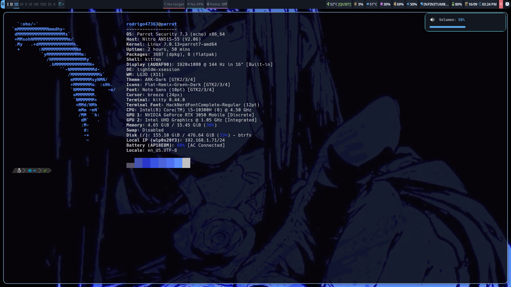
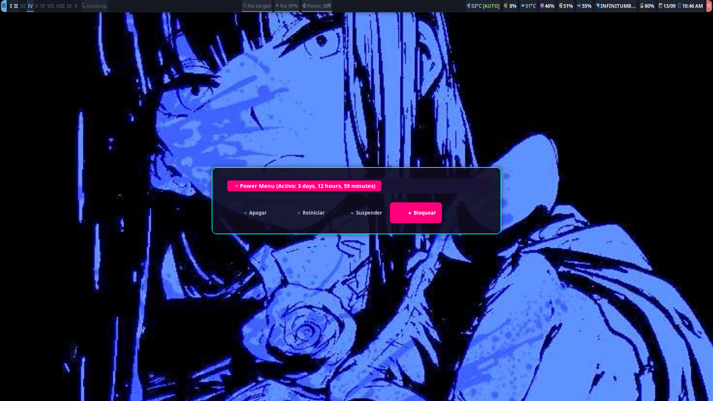
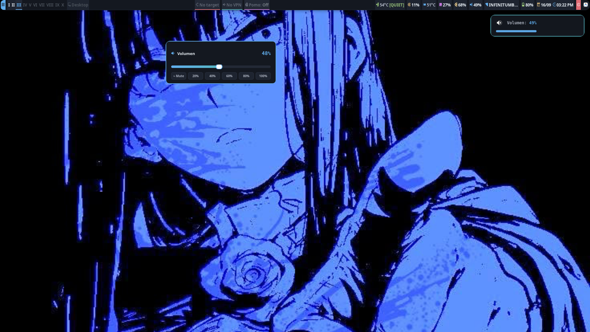

# ⚙️ Dotfiles — Offensive Security, Pentesting & Development Environment

<p align="center">
  
</p>

[](https://opensource.org/licenses/MIT)
[](https://parrotsec.org/)
[](https://github.com/baskerville/bspwm)
[](https://github.com/baskerville/sxhkd)
[](https://polybar.github.io/)
[](https://github.com/rodrigo47363/dotfiles)

> 🌐 **Languages:** [English](README.md) | [Español](README_es.md)

---

## 🧩 Overview & System Architecture

This repository hosts and synchronizes the comprehensive configuration of a high-performance workstation engineered for **Offensive Security, Red Team Operations, Bug Bounty, and Software Development**.

Built on Debian/Parrot OS Linux distributions, the environment employs a minimal, decoupled **Tiling Window Manager** architecture:

* **Window Manager:** [BSPWM](https://github.com/baskerville/bspwm) (binary space partitioning tree model).
* **Hotkey Daemon:** [SXHKD](https://github.com/baskerville/sxhkd) (pure `Super`/Mod4 binding architecture, collision-free).
* **Status Bar:** [Polybar](https://github.com/polybar/polybar) modular bar with real-time hardware telemetry and tactical pentesting scripts.
* **Application Launcher / Menus:** [Rofi](https://github.com/davatorium/rofi) featuring single-instance toggles and dynamic themes.
* **Terminal Emulator:** [Kitty](https://sw.kovidgoyal.net/kitty/) GPU-accelerated with *Hack Nerd Font*, ligatures, and native multiplexing.
* **Shell:** [Zsh](https://www.zsh.org/) configured with [Powerlevel10k](https://github.com/romkatv/powerlevel10k), predictive autosuggestions, and syntax highlighting.
* **Hardware & Telemetry:** Native compiled Rust backend for **AcerSense / NitroSense** fan profiling and thermal management.

---

## 🛡️ OPSEC & Repository Security Standards

To adhere to strict Operational Security (OPSEC) practices:
1. **Zero-Trust Tracking:** Private SSH keys (`id_rsa`, `id_ed25519`), API secrets (`ghp_`, `AWS_*`), browser cookies, and shell history files (`.zsh_history`, `.bash_history`) are strictly excluded.
2. **Backup Sanitization:** Local archive dumps (`.rar`, `.zip`, `.tar.gz`) containing unredacted system backups are ignored via `.gitignore`.
3. **Network Sanitization:** All tracked network and VPN scripts utilize generic interfaces and dynamic extraction to prevent internal corporate/lab subnet leakage.

---

## 🚀 Quick Deployment (Installation & Sync)

### 1. Clone the Repository
```bash
git clone https://github.com/rodrigo47363/dotfiles.git ~/dotfiles
cd ~/dotfiles
```

### 2. Deploy Configurations to `~/.config`
```bash
# Create directory tree
mkdir -p ~/.config/{bspwm/scripts,sxhkd,polybar/scripts,rofi/themes,kitty,dunst,picom} ~/.local/bin

# Deploy dotfiles
cp -r polybar/* ~/.config/polybar/
cp -r rofi/* ~/.config/rofi/
cp sxhkdrc ~/.config/sxhkd/sxhkdrc
cp bspwmrc ~/.config/bspwm/bspwmrc
cp bspwm_resize ~/.config/bspwm/scripts/bspwm_resize
cp kitty.conf ~/.config/kitty/kitty.conf
cp dunst/dunstrc ~/.config/dunst/dunstrc
cp picom/picom.conf ~/.config/picom/picom.conf
cp bin/* ~/.local/bin/
cp .zshrc ~/.zshrc

# Grant executable permissions
chmod +x ~/.config/bspwm/bspwmrc ~/.config/bspwm/scripts/*
chmod +x ~/.config/polybar/launch.sh ~/.config/polybar/scripts/*
chmod +x ~/.local/bin/*
```

---

## 🧰 Base System Dependencies (Debian / Parrot / Kali)

```bash
sudo apt update -y && sudo apt install -y \
    bspwm sxhkd polybar rofi picom feh kitty zsh tmux neovim \
    xinput brightnessctl pamixer xclip libnotify-bin curl wget jq bat \
    python3-pyqt5 build-essential cmake pkg-config openvpn network-manager \
    zsh-syntax-highlighting zsh-autosuggestions \
    fonts-noto fonts-font-awesome \
    && sudo updatedb
```

---

## ⌨️ Tactical Hotkey Map (`sxhkdrc`)

Keybindings are centralized in [`sxhkdrc`](sxhkdrc). All shortcuts use **Pure Super Bindings** (`Mod4` / Windows Key), entirely eliminating conflicts with the `Alt` key required by web browsers, Burp Suite, and terminal editors.

### 🖥️ Window & System Management (BSPWM)
| Shortcut | Action |
|---|---|
| <kbd>Super</kbd> + <kbd>Return</kbd> | Launch primary Kitty terminal (`/opt/kitty/bin/kitty`) |
| <kbd>Super</kbd> + <kbd>Shift</kbd> + <kbd>Return</kbd> | Launch floating Kitty terminal window |
| <kbd>Super</kbd> + <kbd>W</kbd> | Close focused window cleanly (`bspc node -c`) |
| <kbd>Super</kbd> + <kbd>Shift</kbd> + <kbd>W</kbd> | Force-kill unresponsive process immediately (`bspc node -k`) |
| <kbd>Super</kbd> + <kbd>T</kbd> | Set window state to Tiled |
| <kbd>Super</kbd> + <kbd>S</kbd> | Set window state to Floating |
| <kbd>Super</kbd> + <kbd>F</kbd> | Toggle Fullscreen mode |
| <kbd>Super</kbd> + <kbd>Esc</kbd> | Reload `sxhkd` hotkeys on-the-fly (`pkill -USR1 -x sxhkd`) |
| <kbd>Super</kbd> + <kbd>Shift</kbd> + <kbd>Esc</kbd> | Emergency GUI kill-switch cursor (`xkill`) |
| <kbd>Super</kbd> + <kbd>Alt</kbd> + <kbd>R</kbd> | Cleanly restart Polybar instances (`launch.sh`) |
| <kbd>Super</kbd> + <kbd>Shift</kbd> + <kbd>Q</kbd> | Quit BSPWM / End X11 session (`bspc quit`) |

### 🧭 Navigation & Workspace Management
| Shortcut | Action |
|---|---|
| <kbd>Super</kbd> + <kbd>1</kbd> - <kbd>0</kbd> | Direct jump to Desktop Workspaces 1 through 10 |
| <kbd>Super</kbd> + <kbd>Shift</kbd> + <kbd>1</kbd> - <kbd>0</kbd> | **Send focused window to Workspace and transfer focus** (`--follow`) |
| <kbd>Super</kbd> + <kbd>Ctrl</kbd> + <kbd>Shift</kbd> + <kbd>1</kbd> - <kbd>0</kbd> | Move focused window to Workspace silently in background |
| <kbd>Super</kbd> + <kbd>←</kbd> <kbd>↓</kbd> <kbd>↑</kbd> <kbd>→</kbd> | Change window focus (West, South, North, East) |
| <kbd>Super</kbd> + <kbd>H</kbd> <kbd>J</kbd> <kbd>K</kbd> <kbd>L</kbd> | Vim-style directional focus (West, South, North, East) |
| <kbd>Super</kbd> + <kbd>Shift</kbd> + <kbd>H/J/K/L</kbd> | Swap physical window positions |
| <kbd>Super</kbd> + <kbd>Ctrl</kbd> + <kbd>Shift</kbd> + <kbd>H/J/K/L</kbd> | Resize active window in 20px steps |

### 🚀 Application Launchers & Tools (Rofi & Apps)
| Shortcut | Action |
|---|---|
| <kbd>Super</kbd> + <kbd>D</kbd> or <kbd>Space</kbd> | Toggle Rofi Application Launcher (`drun` with single-instance lock) |
| <kbd>Super</kbd> + <kbd>R</kbd> | Rofi Command Runner (`run`) |
| <kbd>Super</kbd> + <kbd>Tab</kbd> | Rofi Open Window Selector (`window`) |
| <kbd>Super</kbd> + <kbd>Shift</kbd> + <kbd>Space</kbd> | Combined Launcher mode (`combi`) |
| <kbd>Super</kbd> + <kbd>Shift</kbd> + <kbd>F</kbd> | Launch Firefox browser |
| <kbd>Super</kbd> + <kbd>Shift</kbd> + <kbd>B</kbd> | Launch Burp Suite Professional / Community |
| <kbd>Super</kbd> + <kbd>V</kbd> | Launch Stremio with initialization wrapper |
| <kbd>Alt</kbd> + <kbd>F4</kbd> | **Interactive Rofi Power Menu** (`powermenu`) |

<p align="center">
  
</p>

### 🍅 Pomodoro Work Timer (`pomoc`)
| Shortcut | Action |
|---|---|
| <kbd>Super</kbd> + <kbd>Ctrl</kbd> + <kbd>P</kbd> | Start / Toggle Pause-Resume focus block (`toggle`) |
| <kbd>Super</kbd> + <kbd>Ctrl</kbd> + <kbd>E</kbd> | Finish current focus session and skip to break (`end`) |
| <kbd>Super</kbd> + <kbd>Ctrl</kbd> + <kbd>R</kbd> | **Reset timer to default starting duration in IDLE** (`reset`) |
| <kbd>Super</kbd> + <kbd>Ctrl</kbd> + <kbd>S</kbd> | Stop the Pomodoro background daemon (`stop`) |
| <kbd>Super</kbd> + <kbd>Alt</kbd> + <kbd>P</kbd> | **Interactive Rofi Pomodoro Menu** (custom durations, resets, daemon controls) |

### 🌀 AcerSense / NitroSense Telemetry
| Shortcut | Action |
|---|---|
| <kbd>XF86Launch1</kbd> / <kbd>Nitro Key [N]</kbd> | Open AcerSense / NitroSense GUI |
| <kbd>Super</kbd> + <kbd>N</kbd> | Software hotkey to launch the AcerSense GUI |
| <kbd>Super</kbd> + <kbd>Shift</kbd> + <kbd>N</kbd> | Toggle fans between **MAX Turbo** and **Auto Quiet** mode (OSD feedback) |

### 🔊 Audio, Brightness & Interactive OSD Sliders
| Shortcut | Action |
|---|---|
| <kbd>XF86AudioRaiseVolume</kbd> or <kbd>Super</kbd> + <kbd>↑</kbd> | Raise volume by 1% with live animated OSD bar (`volume up`) |
| <kbd>XF86AudioLowerVolume</kbd> or <kbd>Super</kbd> + <kbd>↓</kbd> | Lower volume by 1% with live animated OSD bar (`volume down`) |
| <kbd>XF86AudioMute</kbd> or <kbd>Super</kbd> + <kbd>Shift</kbd> + <kbd>M</kbd> | Toggle audio mute status (`volume mute`) |
| <kbd>XF86AudioMicMute</kbd> | Toggle microphone mute status (`volume mic`) |
| <kbd>XF86MonBrightnessUp</kbd> | Raise brightness by 1% with live animated OSD bar (`brightness up`) |
| <kbd>XF86MonBrightnessDown</kbd> | Lower brightness by 1% with hardware blackout floor protection (`brightness down`) |
| <kbd>Super</kbd> + <kbd>Alt</kbd> + <kbd>V</kbd> | **Open / Close Floating Interactive Volume Slider** (`volume-slider`) |
| <kbd>Super</kbd> + <kbd>Alt</kbd> + <kbd>B</kbd> | **Open / Close Floating Interactive Brightness Slider** (`brightness-slider`) |

<p align="center">
  
  
</p>

---

## 📊 Polybar — Tactical Modular Suite (`config.ini`)

The top status bar is divided into three functional zones:

```ini
modules-left   = launcher bspwm xwindow
modules-center = target vpn pomodoro
modules-right  = filesystem cpu temperature gpu acersense memory backlight pulseaudio wlan eth battery date powermenu systray
```

### 🎯 Offensive Security Core Modules

#### 1. Multi-Environment VPN Module ([`vpn.sh`](polybar/scripts/vpn.sh))
Specifically engineered for penetration testing and Red Team engagements:
* **Standard VPN Indicator (`󰖀` / `U+F0580`):** Automatically maps commercial VPN tunnels, WireGuard, and standard OpenVPN.
* **Proton VPN Native Recognition:**
  * Detects `proton*` interfaces (e.g. `proton0`), daemons (`proton-vpn-daemon`), and desktop clients.
  * Tag: `PROTON`, Icon: `󰖀`, Color: `#6d4aff` (corporate brand purple).
* **Automated Lab Platform Detection:**
  * **Hack The Box (HTB):** `󰆧 HTB: <IP>` in tactical green (`#98c379`).
  * **TryHackMe (THM):** `󰅣 THM: <IP>` in red (`#e06c75`).
  * **OffSec / Proving Grounds:** ` OFFSEC: <IP>` in amber (`#d19a66`).
  * **WireGuard Generic:** `󰒄 WG: <IP>` in blue (`#61afef`).
  * **Tailscale:** `󰛳 TS: <IP>` in cyan (`#56b6c2`).
* **Tactical Dual-Homed Interface Prioritization:** If you maintain a connected Proton VPN for privacy and launch a laboratory VPN (`tun0` to HTB/THM), the module instantly promotes the lab IP as your active `LHOST` display. Disconnecting the lab reverts seamlessly back to Proton VPN.
* **Interactive Actions:**
  * **Left Click:** Instantly copy active `LHOST` IP address to clipboard with desktop notification.

#### 2. Target Machine Tracker ([`target.sh`](polybar/scripts/target.sh))
* Polls `~/.config/bin/target` containing `IP [Machine_Name]`.
* Validates target host reachability with a fast ICMP ping check (1s timeout):
  * Responsive: Bright green `󰓾` icon and crisp target name.
  * Unreachable: Dim red `󰓾` icon.
* Truncates long names to 10 characters with an ellipsis (`..`) to preserve bar real estate.
* **Left Click:** Copies target IP to clipboard.
* **Right Click:** Clears target file (`No target`).

#### 3. Pomodoro Work Timer ([`pomodoro.sh`](polybar/scripts/pomodoro.sh))
* Direct UNIX domain socket connection to the [`pomoc`](https://github.com/dream-wa1ker/pomoc) binary.
* Displays remaining duration and phase: Work (``), Pause (`⏸`), Break (``).
* **1-Finger Tap (Left Click):** Start / Pause / Resume (`toggle`).
* **Double Tap:** **Reset timer to default starting duration in IDLE (`reset`)**.
* **2-Finger Tap (Right Click):** Skip current block to break (`end`).
* **2-Finger Swipe Up (Scroll Up):** **Reset timer to IDLE (`reset`)**.
* **2-Finger Swipe Down (Scroll Down):** **Open Rofi Pomodoro Menu (`menu`)**.
* **Middle Click (Physical Wheel):** Reset timer (`reset`).

---

### 💻 Hardware & Performance Telemetry

* **NVIDIA GPU with D3cold Sleep Guard ([`gpu.sh`](polybar/scripts/gpu.sh)):**
  * Reads `/sys/bus/pci/devices/*/power/runtime_status`.
  * If the discrete GPU is power-gated in deep sleep (`suspended`), it outputs `󰢮 GPU Off` in muted gray `#5c6370` and **strictly skips invoking `nvidia-smi`**, preventing the discrete GPU from waking up and conserving critical battery life.
* **AcerSense / NitroSense Telemetry ([`acersense.sh`](polybar/scripts/acersense.sh)):**
  * Native Rust binary backend with sub-2ms response times.
  * Displays fan RPM telemetry and combined CPU/GPU thermals.
  * **Left Click:** Toggles between quiet auto mode and **MAX TURBO**.
  * **Right Click:** Launches AcerSense GUI.
* **Interactive Mouse & OSD Controls:**
  * **Volume (`󰕾`):** Left-click opens floating `volume-slider` for continuous drag or quick presets (`20%`-`100%`). Mouse wheel scroll raises/lowers level by 1% with live cyan Dunst OSD bar animation. Middle-click toggles mute; right-click opens `alsamixer`.
  * **Brightness (`󰃠`):** Left-click opens floating `brightness-slider`. Mouse wheel scroll raises/lowers level by 1% with live amber Dunst OSD bar animation and safe minimum backlight floor protection (`-n 1`).
* **WiFi Network Manager ([`wifi-menu.sh`](polybar/scripts/wifi-menu.sh)):**
  * Rofi interface for scanning wireless networks, checking signal strength, and entering secured passphrases.

---

## 🪟 BSPWM Architecture Highlights (`bspwmrc`)

Key configurations implemented in [`bspwmrc`](bspwmrc):
* **Java GUI Fix:** `wmname LG3D &` resolves gray/blank render issues on Java Swing/AWT applications such as **Burp Suite Professional**.
* **X11 Keyboard State Cleanup:** Remaps orphaned keys and disables residual lock states (`xmodmap`, `numlockx`).
* **Hardware Touchpad Detection:** Dynamic device loop applying *Tap-to-click* and *Natural Scrolling* via `libinput` across arbitrary pointer device IDs.
* **Clean Process Lifecycle:** Verifies and kills orphan instances prior to spawning `sxhkd`, `picom`, `polybar`, `dunst`, and background wallpaper managers (`feh`).
* **OSD Floating Rules:** Tailored window rules ensuring GUI sliders (`OsdSlider_volume` and `OsdSlider_brightness`) float borderless with immediate focus.

---

## 🖥️ Kitty Terminal Emulator (`kitty.conf`)

* **Typography:** *Hack Nerd Font* at 12pt with full ligature rendering.
* **Transparency & Rendering:** 85% background opacity (`background_opacity 0.85`), vertical sync enabled (`sync_to_monitor yes`), and zero perceptible input latency.
* **Window Navigation:** Splits traversed effortlessly via <kbd>Ctrl</kbd> + <kbd>Arrow Keys</kbd>.
* **Multi-Buffer System:** Dedicated copy-paste storage across buffers `a` and `b` using keys <kbd>F1</kbd> through <kbd>F4</kbd>.

---

## 🛠️ Troubleshooting & Frequently Asked Questions (FAQ)

### 1. 🔤 Polybar or terminal icons display as missing glyphs or square boxes
* **Root Cause:** Required *Nerd Fonts* or icon glyphs are not indexed in the system Fontconfig cache.
* **Remedy:** Copy the fonts bundled within the repository to your local user font directory and rebuild the cache:
  ```bash
  mkdir -p ~/.local/share/fonts
  cp ~/dotfiles/polybar/fonts/* ~/.local/share/fonts/
  fc-cache -f -v
  ```
  Restart Polybar cleanly with <kbd>Super</kbd> + <kbd>Alt</kbd> + <kbd>R</kbd>.

### 2. ☀️ Brightnessctl returns permission errors or screen turns completely black
* **Permissions:** If `brightnessctl` requires root privileges, append your user account to the `video` and `input` groups:
  ```bash
  sudo usermod -aG video,input $USER
  ```
  *(Log out and log back in for group membership changes to take effect).*
* **Blackout Floor Protection:** The custom controller `~/.local/bin/brightness` implements hardware clamp protection with `-n 1` (`brightnessctl set 1% -n 1`), preventing luminance from ever reaching 0% (complete blackout).

### 3. 📜 Scrolling on Polybar brightness module does not show the Dunst OSD bar
* **Root Cause:** Polybar's native `internal/backlight` module consumes mouse wheel events internally when `enable-scroll = true`, directly modifying `/sys/class/backlight` without notifying the user session.
* **Remedy:** In `~/.config/polybar/config.ini`, set:
  ```ini
  enable-scroll = false
  format = <ramp> %{A1:~/.local/bin/brightness-slider:}%{A4:~/.local/bin/brightness up 1:}%{A5:~/.local/bin/brightness down 1:}<label>%{A}%{A}%{A}
  ```
  This routes scroll actions (`A4`/`A5`) to our CLI controller, triggering atomic, animated Dunst progress notifications.

### 4. 🎚️ Interactive sliders fail to launch with "ModuleNotFoundError: No module named 'PyQt5'"
* **Root Cause:** Python 3 PyQt5 graphics runtime libraries are missing from the host system.
* **Remedy:** Install the native Debian/Ubuntu package:
  ```bash
  sudo apt install -y python3-pyqt5
  ```
  Test manual execution from terminal to verify:
  ```bash
  python3 ~/.local/bin/osd-slider.py volume
  ```

### 5. ☕ Burp Suite or Java applications render as blank gray boxes in BSPWM
* **Root Cause:** Java AWT/Swing toolkit historical incompatibilities with non-reparenting window managers such as BSPWM or XMonad.
* **Remedy:** `bspwmrc` already exports the industry-standard workaround:
  ```bash
  wmname LG3D &
  export _JAVA_AWT_WM_NONREPARENTING=1
  ```
  If launching standalone `.jar` tools manually from shell, append `export _JAVA_AWT_WM_NONREPARENTING=1` to your `~/.zshrc`.

### 6. ⌨️ Keybindings become unresponsive after editing `sxhkdrc`
* **Remedy:** Trigger an in-place configuration reload via USR1 signal:
  ```bash
  pkill -USR1 -x sxhkd
  ```
  If hotkeys remain locked, check for syntax errors or multiple running daemon instances:
  ```bash
  killall sxhkd && sxhkd -c ~/.config/sxhkd/sxhkdrc &
  ```
  For deep X11 modifier lock debugging (NumLock/CapsLock interference), refer to [`KEYBOARD_AND_SHORTCUTS_TROUBLESHOOTING.md`](KEYBOARD_AND_SHORTCUTS_TROUBLESHOOTING.md).

### 7. 🔋 NVIDIA discrete GPU causes high battery drain while idle (Hybrid Laptops)
* **Remedy:** The telemetry script [`polybar/scripts/gpu.sh`](polybar/scripts/gpu.sh) features an integrated D3cold power gate check. When `/sys/bus/pci/devices/*/power/runtime_status` is `suspended`, it halts calls to `nvidia-smi`, enabling the NVIDIA card to stay powered down (0W consumption) until 3D or CUDA workloads demand it.

---

## 📁 Repository Directory Structure

```text
dotfiles/
├── assets/                               # Environment screenshots and showcases
│   ├── preview.png                       # Primary desktop showcase (BSPWM + Polybar + Fastfetch + OSD)
│   ├── powermenu.png                     # Horizontal interactive power menu (Neo Tokyo Edition)
│   ├── osd_volume.png                    # Interactive floating slider and volume OSD showcase
│   └── osd_brightness.png                # Interactive floating slider and brightness OSD showcase
├── bin/                                  # Modular operational scripts (~/.local/bin)
│   ├── volume                           # Volume CLI controller with Dunst OSD and 1% step
│   ├── brightness                       # Brightness CLI controller with Dunst OSD, 1% step, and floor safety
│   ├── osd-slider.py                    # Lightweight PyQt5 floating GUI slider for mouse-driven adjustments
│   ├── volume-slider                    # Toggle launcher wrapper for volume slider
│   └── brightness-slider                # Toggle launcher wrapper for brightness slider
├── bspwmrc                              # BSPWM initialization and window rule engine
├── dunst/                               # Notification daemon & OSD styling
│   └── dunstrc                          # OneDark aesthetic, rounded progress bars, and transient rules
├── picom/                               # Compositor configuration
│   └── picom.conf                       # GLX backend, hardware shadows, and smooth fading transitions
├── sxhkdrc                              # Global keybinding daemon configuration (Pure Super Mod4)
├── bspwm_resize                         # Tiling window resizing utility
├── KEYBOARD_AND_SHORTCUTS_TROUBLESHOOTING.md # X11 modifier and keyboard troubleshooting guide
├── kitty.conf                           # Kitty GPU terminal configuration
├── polybar/                             # Polybar status bar suite
│   ├── config.ini                       # Master bar layout, modules, and OneDark color definitions
│   ├── launch.sh                        # Polybar multi-monitor safe initialization script
│   ├── fonts/                           # TTF/OTF typography suite (Hack Nerd Font, Iosevka, feather)
│   └── scripts/                         # Tactical Polybar scripts
│       ├── acersense.sh                 # AcerSense fan telemetry & MAX turbo switcher (Rust backend)
│       ├── gpu.sh                       # NVIDIA discrete GPU telemetry with D3cold idle sleep guard
│       ├── launcher                     # Single-instance Rofi application launcher
│       ├── pomodoro.sh                  # UNIX socket Pomodoro timer daemon client (pomoc)
│       ├── target.sh                    # Offensive target IP tracker with fast ICMP ping check
│       ├── vpn.sh                       # Multi-platform VPN detection (HTB, THM, OffSec, Proton)
│       └── wifi-menu.sh                 # Interactive WiFi selection and connection utility
├── rofi/                                # Rofi menus and styling
│   ├── config.rasi                      # Modes, key navigation, and visual interface
│   └── themes/                          # Custom colorways and Tokyo Night / OneDark themes
├── .zshrc                               # Zsh configuration with Powerlevel10k, aliases, and toolpaths
├── README.md                            # Comprehensive Technical Documentation (English)
└── README_es.md                         # Documentación Técnica Completa (Español)
```

---

## 👤 Author & License

**Rodrigo Villegas** — Ethical Hacker | Pentester | Red Team Specialist

* **Focus Areas:** Offensive Security, Network Auditing, Lab Infrastructure & Automation.
* **GitHub:** [@rodrigo47363](https://github.com/rodrigo47363)

Distributed under the [MIT License](https://opensource.org/licenses/MIT).

> ⚡ *"Customize everything. Automate what you can. Hack ethically."*
