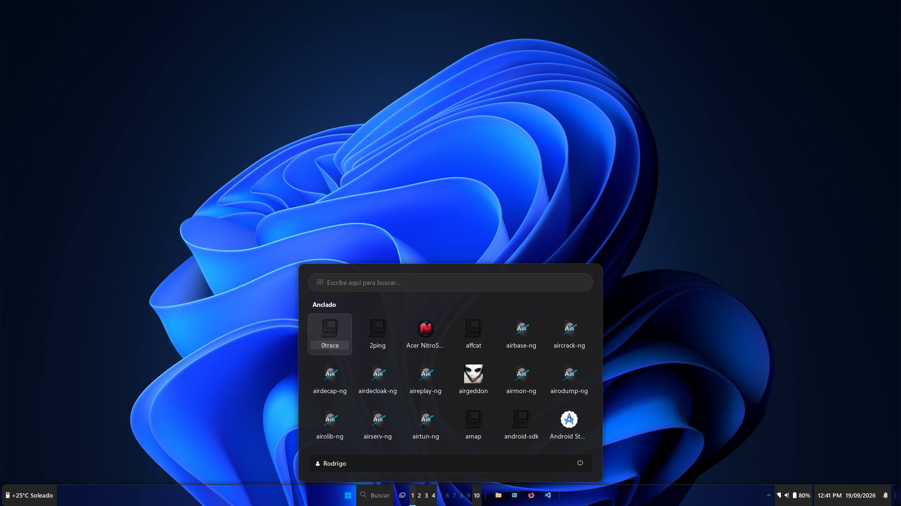
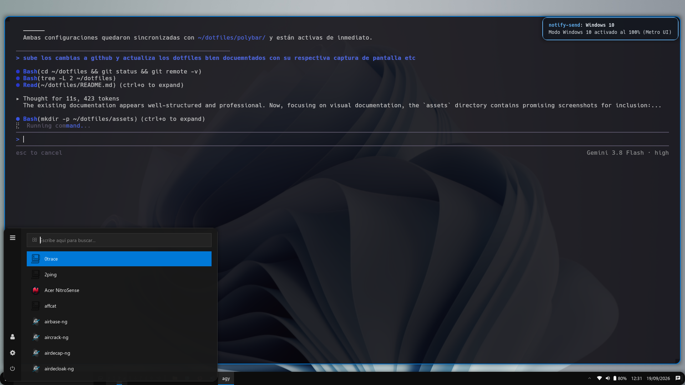
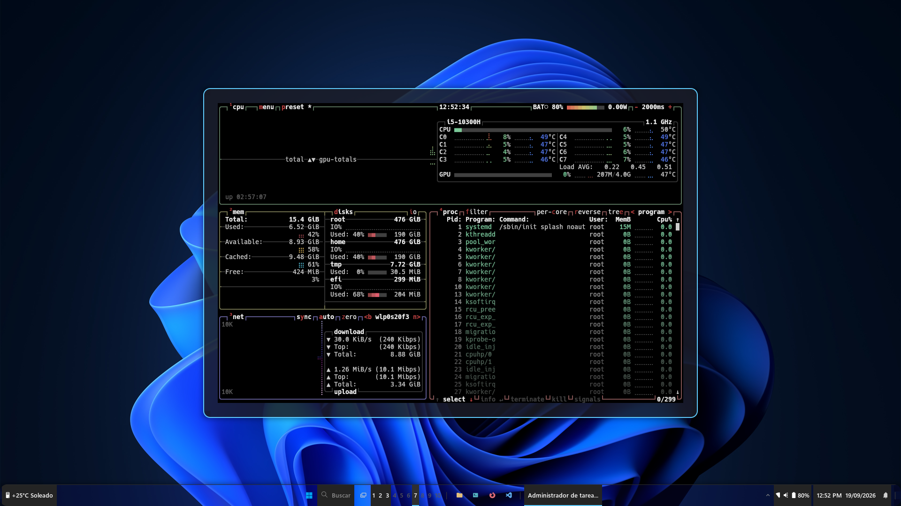

# ⚙️ Dotfiles — Entorno de Auditoría Ofensiva, Pentesting y Desarrollo

<p align="center">
  
</p>

[](https://opensource.org/licenses/MIT)
[](https://parrotsec.org/)
[](https://github.com/baskerville/bspwm)
[](https://github.com/baskerville/sxhkd)
[](https://polybar.github.io/)
[](https://github.com/rodrigo47363/dotfiles)

> 🌐 **Idiomas:** [English](README.md) | [Español](README_es.md)

---

## 🧩 Descripción y Arquitectura del Entorno

Este repositorio almacena y sincroniza la configuración integral de un entorno de trabajo de alto rendimiento optimizado para **Seguridad Ofensiva, Operaciones de Red Team, Bug Bounty y Desarrollo de Software**.

Construido sobre distribuciones basadas en Debian/Parrot OS, el sistema utiliza una arquitectura de **gestión de ventanas en mosaico (Tiling Window Manager)** minimalista y desacoplada:

* **Gestor de Ventanas:** [BSPWM](https://github.com/baskerville/bspwm) (árbol binario de división del espacio).
* **Gestor de Atajos:** [SXHKD](https://github.com/baskerville/sxhkd) (arquitectura pura basada en tecla `Super` sin colisiones).
* **Barra de Estado:** [Polybar](https://github.com/polybar/polybar) modular con telemetría en tiempo real y scripts tácticos para pentesting.
* **Lanzador / Menú:** [Rofi](https://github.com/davatorium/rofi) con modo single-instance y soporte de temas dinámicos.
* **Emulador de Terminal:** [Kitty](https://sw.kovidgoyal.net/kitty/) acelerado por GPU con fuente *Hack Nerd Font*, ligaduras y multiplexación nativa.
* **Shell:** [Zsh](https://www.zsh.org/) con tema [Powerlevel10k](https://github.com/romkatv/powerlevel10k), autocompletado predictivo y sintaxis enriquecida.
* **Hardware & Telemetría:** Integración nativa en Rust con **AcerSense / NitroSense** para control térmico y perfilado de ventiladores.

---

## 🛡️ OPSEC y Seguridad del Repositorio

Como estándar de seguridad operativa (OPSEC):
1. **Política Zero-Trust:** Ninguna clave privada SSH (`id_rsa`, `id_ed25519`), token de API (`ghp_`, `AWS_*`), cookie de sesión o historial de shell (`.zsh_history`, `.bash_history`) debe ser rastreado en Git.
2. **Exclusión de volcados:** El archivo `.gitignore` debe excluir volcados comprimidos (`.rar`, `.zip`, `.tar.gz`) que contengan copias de respaldo locales.
3. **Manejo de credenciales de red:** Toda configuración de red o VPN rastreada utiliza interfaces genéricas y variables dinámicas para evitar filtrar subredes internas.

---

## 🚀 Despliegue Rápido (Instalación & Sincronización)

### 1. Clonar el Repositorio
```bash
git clone https://github.com/rodrigo47363/dotfiles.git ~/dotfiles
cd ~/dotfiles
```

### 2. Desplegar Enlaces Simbólicos / Copiar a `~/.config`
```bash
# Crear estructura base
mkdir -p ~/.config/{bspwm/scripts,sxhkd,polybar/scripts,rofi/themes,kitty,dunst,picom} ~/.local/bin

# Desplegar configuraciones
cp -r polybar/* ~/.config/polybar/
cp -r rofi/* ~/.config/rofi/
cp sxhkdrc ~/.config/sxhkd/sxhkdrc
cp bspwmrc ~/.config/bspwm/bspwmrc
cp bspwm_resize ~/.config/bspwm/scripts/bspwm_resize
cp kitty.conf ~/.config/kitty/kitty.conf
cp dunst/dunstrc ~/.config/dunst/dunstrc
cp picom/picom.conf ~/.config/picom/picom.conf
cp bin/* ~/.local/bin/
cp .zshrc ~/.zshrc

# Asignar permisos de ejecución a los binarios y scripts
chmod +x ~/.config/bspwm/bspwmrc ~/.config/bspwm/scripts/*
chmod +x ~/.config/polybar/launch.sh ~/.config/polybar/scripts/*
chmod +x ~/.local/bin/*
```

---

## 🧰 Dependencias Base del Sistema (Debian / Parrot / Kali)

```bash
sudo apt update -y && sudo apt install -y \
    bspwm sxhkd polybar rofi picom feh kitty zsh tmux neovim \
    dunst lxpolkit numlockx suckless-tools i3lock flameshot scrot \
    x11-xserver-utils x11-utils xinput alsa-utils brightnessctl pamixer \
    eza fzf fastfetch bat jq xclip libnotify-bin curl wget plocate \
    wireguard-tools openvpn network-manager \
    python3-pyqt5 build-essential cmake pkg-config \
    zsh-syntax-highlighting zsh-autosuggestions \
    fonts-hack-ttf fonts-jetbrains-mono fonts-noto fonts-font-awesome \
    && sudo updatedb
```

---

## ⌨️ Mapa Táctico de Atajos de Teclado (`sxhkdrc`)

El archivo [`sxhkdrc`](sxhkdrc) centraliza los accesos rápidos. Toda la arquitectura fue migrada a **Pure Super Bindings** (`Mod4` / Tecla Windows), eliminando por completo las colisiones con la tecla `Alt` requeridas en navegadores, Burp Suite y editores.

### 🖥️ Gestión de Ventanas y Sistema (BSPWM)
| Atajo | Acción Operativa |
|---|---|
| <kbd>Super</kbd> + <kbd>Return</kbd> | Abrir terminal Kitty principal (`/opt/kitty/bin/kitty`) |
| <kbd>Super</kbd> + <kbd>Shift</kbd> + <kbd>Return</kbd> | Abrir terminal Kitty en ventana flotante |
| <kbd>Super</kbd> + <kbd>W</kbd> | Cerrar ventana enfocada (`bspc node -c`) |
| <kbd>Super</kbd> + <kbd>Shift</kbd> + <kbd>W</kbd> | Forzar terminación inmediata del proceso (`bspc node -k`) |
| <kbd>Super</kbd> + <kbd>T</kbd> | Cambiar ventana a modo Mosaico (*tiled*) |
| <kbd>Super</kbd> + <kbd>S</kbd> | Cambiar ventana a modo Flotante (*floating*) |
| <kbd>Super</kbd> + <kbd>F</kbd> | Alternar modo Pantalla Completa (*fullscreen*) |
| <kbd>Super</kbd> + <kbd>Esc</kbd> | Recargar configuración de `sxhkd` al vuelo (`pkill -USR1 -x sxhkd`) |
| <kbd>Super</kbd> + <kbd>Shift</kbd> + <kbd>Esc</kbd> | Kill-switch de emergencia (`xkill`) para ventanas colgadas |
| <kbd>Super</kbd> + <kbd>Alt</kbd> + <kbd>R</kbd> | Reiniciar Polybar limpiamente (`launch.sh`) |
| <kbd>Super</kbd> + <kbd>Shift</kbd> + <kbd>Q</kbd> | Cerrar sesión / Salir de BSPWM (`bspc quit`) |

### 🧭 Navegación y Control de Espacios de Trabajo
| Atajo | Acción Operativa |
|---|---|
| <kbd>Super</kbd> + <kbd>1</kbd> - <kbd>0</kbd> | Cambiar directamente al Espacio de Trabajo 1 al 10 |
| <kbd>Super</kbd> + <kbd>Shift</kbd> + <kbd>1</kbd> - <kbd>0</kbd> | **Mover ventana enfocada al Workspace y transferir el foco** (`--follow`) |
| <kbd>Super</kbd> + <kbd>Ctrl</kbd> + <kbd>Shift</kbd> + <kbd>1</kbd> - <kbd>0</kbd> | Mover ventana enfocada en segundo plano sin cambiar de escritorio |
| <kbd>Super</kbd> + <kbd>←</kbd> <kbd>↓</kbd> <kbd>↑</kbd> <kbd>→</kbd> | Cambiar foco de ventana (Oeste, Sur, Norte, Este) |
| <kbd>Super</kbd> + <kbd>H</kbd> <kbd>J</kbd> <kbd>K</kbd> <kbd>L</kbd> | Foco estilo Vim (Oeste, Sur, Norte, Este) |
| <kbd>Super</kbd> + <kbd>Shift</kbd> + <kbd>H/J/K/L</kbd> | Intercambiar posición física de ventanas |
| <kbd>Super</kbd> + <kbd>Ctrl</kbd> + <kbd>Shift</kbd> + <kbd>H/J/K/L</kbd> | Redimensionar ventana activa en bloques de 20px |

### 🚀 Lanzadores y Herramientas (Rofi & Apps)
| Atajo | Acción Operativa |
|---|---|
| <kbd>Super</kbd> + <kbd>D</kbd> o <kbd>Espacio</kbd> | Alternar Menú de Aplicaciones Rofi (`drun` con toggle de instancia única) |
| <kbd>Super</kbd> + <kbd>R</kbd> | Modo ejecución de comandos Rofi (`run`) |
| <kbd>Super</kbd> + <kbd>E</kbd> | Lanzar Explorador de Archivos (`file-explorer` - Caja / Dolphin) |
| <kbd>Ctrl</kbd> + <kbd>Shift</kbd> + <kbd>Esc</kbd> | Lanzar Administrador de Tareas flotante (`task-manager` - Btop) |
| <kbd>Super</kbd> + <kbd>Tab</kbd> | Selector de ventanas abiertas Rofi (`window`) |
| <kbd>Super</kbd> + <kbd>Shift</kbd> + <kbd>Espacio</kbd> | Lanzador combinado Rofi (`combi`) |
| <kbd>Super</kbd> + <kbd>Shift</kbd> + <kbd>F</kbd> | Lanzar navegador web (Firefox) |
| <kbd>Super</kbd> + <kbd>Shift</kbd> + <kbd>B</kbd> | Lanzar Burp Suite Professional / Community |
| <kbd>Super</kbd> + <kbd>V</kbd> | Lanzar Stremio con wrapper de inicialización |
| <kbd>Alt</kbd> + <kbd>F4</kbd> | Cierre contextual de ventana / Menú de apagado interactivo (`powermenu`) |

<p align="center">
  
</p>

### 🍅 Control Pomodoro (`pomoc`)
| Atajo | Acción Operativa |
|---|---|
| <kbd>Super</kbd> + <kbd>Ctrl</kbd> + <kbd>P</kbd> | Iniciar / Alternar Pausa-Reanudar sesión de enfoque (`toggle`) |
| <kbd>Super</kbd> + <kbd>Ctrl</kbd> + <kbd>E</kbd> | Terminar bloque de concentración actual y saltar a descanso (`end`) |
| <kbd>Super</kbd> + <kbd>Ctrl</kbd> + <kbd>R</kbd> | **Reiniciar temporizador a tiempo inicial en IDLE** (`reset`) |
| <kbd>Super</kbd> + <kbd>Ctrl</kbd> + <kbd>S</kbd> | Detener por completo el demonio Pomodoro (`stop`) |
| <kbd>Super</kbd> + <kbd>Alt</kbd> + <kbd>P</kbd> | **Menú Rofi interactivo Pomodoro** (minutos personalizados, reset, etc.) |

### 🌀 Telemetría AcerSense / NitroSense
| Atajo | Acción Operativa |
|---|---|
| <kbd>XF86Launch1</kbd> / <kbd>Tecla Nitro [N]</kbd> | Abrir GUI de AcerSense / NitroSense |
| <kbd>Super</kbd> + <kbd>N</kbd> | Atajo alternativo por software para abrir la GUI |
| <kbd>Super</kbd> + <kbd>Shift</kbd> + <kbd>N</kbd> | Alternar ventiladores entre **Turbo Máximo** y **Automático** (notificación en pantalla) |

### 🔊 Control de Audio, Brillo y Sliders OSD
| Atajo | Acción Operativa |
|---|---|
| <kbd>XF86AudioRaiseVolume</kbd> o <kbd>Super</kbd> + <kbd>↑</kbd> | Subir volumen de 1 en 1 (1%) con OSD animado (`volume up`) |
| <kbd>XF86AudioLowerVolume</kbd> o <kbd>Super</kbd> + <kbd>↓</kbd> | Bajar volumen de 1 en 1 (1%) con OSD animado (`volume down`) |
| <kbd>XF86AudioMute</kbd> o <kbd>Super</kbd> + <kbd>Shift</kbd> + <kbd>M</kbd> | Alternar silencio de audio (`volume mute`) |
| <kbd>XF86AudioMicMute</kbd> | Alternar silencio de micrófono (`volume mic`) |
| <kbd>XF86MonBrightnessUp</kbd> | Subir brillo de 1 en 1 (1%) con OSD animado (`brightness up`) |
| <kbd>XF86MonBrightnessDown</kbd> | Bajar brillo de 1 en 1 (1%) con protección de pantalla (`brightness down`) |
| <kbd>Super</kbd> + <kbd>Alt</kbd> + <kbd>V</kbd> | **Abrir / Cerrar Slider flotante interactivo de Volumen** (`volume-slider`) |
| <kbd>Super</kbd> + <kbd>Alt</kbd> + <kbd>B</kbd> | **Abrir / Cerrar Slider flotante interactivo de Brillo** (`brightness-slider`) |

<p align="center">
  
  
</p>

---

## 📊 Polybar — Suite Modular Táctica (`config.ini`)

La barra de estado está estructurada en tres secciones ergonómicas:

```ini
modules-left   = launcher bspwm xwindow
modules-center = target vpn pomodoro
modules-right  = filesystem cpu temperature gpu acersense memory backlight pulseaudio wlan eth battery date powermenu systray
```

### 🎯 Módulos Centrales Ofensivos

#### 1. Módulo VPN Multientorno ([`vpn.sh`](polybar/scripts/vpn.sh))
Diseñado específicamente para flujos de trabajo de seguridad ofensiva:
* **Icono Estándar de VPN (`󰖀` / `U+F0580`):** Aplica para VPNs comerciales, genéricas o túneles privados (WireGuard, OpenVPN).
* **Detección Nativa de Proton VPN:**
  * Reconoce interfaces `proton*` (ej. `proton0`), daemons (`proton-vpn-daemon`) y clientes GTK/CLI.
  * Etiqueta: `PROTON`, Icono: `󰖀`, Color: `#6d4aff` (púrpura corporativo).
* **Identificación Automática de Plataformas:**
  * **Hack The Box (HTB):** `󰆧 HTB: <IP>` en verde (`#98c379`).
  * **TryHackMe (THM):** `󰅣 THM: <IP>` en rojo (`#e06c75`).
  * **OffSec / Proving Grounds:** ` OFFSEC: <IP>` en naranja (`#d19a66`).
  * **WireGuard General:** `󰒄 WG: <IP>` en azul (`#61afef`).
  * **Tailscale:** `󰛳 TS: <IP>` en cyan (`#56b6c2`).
* **Priorización Táctica de Interfaces (Dual-Homed):** Si estás conectado a Proton VPN para privacidad y levantas una VPN de laboratorio (`tun0` hacia HTB o THM), el script prioriza inmediatamente la IP del laboratorio para que dispongas de tu `LHOST` al instante. Al desconectar el laboratorio, vuelve de forma transparente a Proton VPN.
* **Acciones Interactivas:**
  * **Click Izquierdo:** Copia instantánea de la dirección IP (`LHOST`) al portapapeles y notificación con `notify-send`.

#### 2. Rastreador de Máquina Objetivo ([`target.sh`](polybar/scripts/target.sh))
* Monitorea el archivo `~/.config/bin/target` conteniendo `IP [Nombre_Maquina]`.
* Comprueba la conectividad de la máquina con un ping ICMP rápido (timeout 1s):
  * Si responde: Icono verde `󰓾` con texto claro.
  * Si no responde: Icono rojo `󰓾` con texto tenue.
* Trunca nombres largos a 10 caracteres con elipsis (`..`) para proteger el espacio de la barra.
* **Click Izquierdo:** Copia la IP objetivo al portapapeles.
* **Click Derecho:** Limpia el archivo de objetivo (`No target`).

#### 3. Temporizador Pomodoro ([`pomodoro.sh`](polybar/scripts/pomodoro.sh))
* Conexión directa mediante sockets UNIX con el binario [`pomoc`](https://github.com/dream-wa1ker/pomoc).
* Muestra tiempo restante y estado: Trabajo (``), Pausa (`⏸`), Descanso (``).
* **Tap 1 dedo (Click Izquierdo):** Iniciar / Pausar / Reanudar (`toggle`).
* **Doble Tap 1 dedo:** **Reiniciar temporizador a tiempo inicial en IDLE (`reset`)**.
* **Tap 2 dedos (Click Derecho):** Concluir bloque y pasar a descanso (`end`).
* **Deslizar 2 dedos Arriba (Scroll Up):** **Reiniciar temporizador a IDLE (`reset`)**.
* **Deslizar 2 dedos Abajo (Scroll Down):** **Abrir Menú Rofi Pomodoro (`menu`)** (tiempos personalizados, reset, daemon kill/restart).
* **Click Central (Rueda de ratón físico):** Reiniciar temporizador (`reset`).

---

### 💻 Módulos de Hardware y Rendimiento

* **GPU NVIDIA con D3cold Sleep Guard ([`gpu.sh`](polybar/scripts/gpu.sh)):**
  * Lee `/sys/bus/pci/devices/*/power/runtime_status`.
  * Si la GPU dedicada NVIDIA está suspendida en bajo consumo (`suspended`), muestra `󰢮 GPU Off` en gris `#5c6370` y **evita ejecutar `nvidia-smi`**, impidiendo que la GPU se despierte y ahorrando batería crítica en portátiles híbridos.
* **AcerSense / NitroSense Telemetry ([`acersense.sh`](polybar/scripts/acersense.sh)):**
  * Backend nativo compilado en Rust con tiempo de respuesta inferior a 2ms.
  * Informa estado de RPM de ventiladores y temperatura de CPU/GPU.
  * **Click Izquierdo:** Alterna entre modo silencioso/automático y modo **MAX TURBO**.
  * **Click Derecho:** Abre la interfaz gráfica de AcerSense.
* **Control Interactivo de Volumen y Brillo por Ratón & OSD:**
  * **Volumen (`󰕾`):** Clic izquierdo abre el popup interactivo `volume-slider` para arrastre libre con ratón o presets rápidos (`20%` a `100%`). Rueda del ratón sube/baja de 1 en 1 mostrando la barra OSD animada en cian. Clic central conmuta silencio (`mute`) y clic derecho abre `alsamixer`.
  * **Brillo (`󰃠`):** Clic izquierdo abre el popup interactivo `brightness-slider`. Rueda del ratón sube/baja de 1 en 1 mostrando la barra OSD animada en ámbar con protección contra apagado total de pantalla (`-n 1`).
* **Gestor WiFi Interactivo ([`wifi-menu.sh`](polybar/scripts/wifi-menu.sh)):**
  * Menú Rofi para escanear redes inalámbricas, consultar fuerza de señal e ingresar contraseñas protegidas.

---

## 🪟 Configuración de BSPWM (`bspwmrc`)

Aspectos destacados implementados en [`bspwmrc`](bspwmrc):
* **Matriz Táctica de Workspaces y Enrutamiento Automático:** Enrutamiento determinista de ventanas por clase (`WM_CLASS`) hacia 10 escritorios especializados para auditoría y desarrollo:
  * **WS 1 (Terminal):** Consola principal acelerada por GPU (`kitty`).
  * **WS 2 (Navegación / OSINT):** Navegadores web aislados (`Firefox`, `Chromium`, `Google Chrome`).
  * **WS 3 (Desarrollo):** IDEs y editores de código (`Code`, `VSCodium`, `Kate`).
  * **WS 4 (Red & Recon):** Herramientas de análisis de tráfico y escaneo (`Wireshark`, `Zenmap`).
  * **WS 5 (Seguridad Web & Proxies):** Entornos de intercepción en mosaico automático (`Burp Suite`, `Caido`, `OWASP ZAP`).
  * **WS 6 (Virtualización & Sandboxes):** Máquinas virtuales y emuladores (`VirtualBox`).
  * **WS 7 (Comunicación):** Mensajería y coordinación (`Telegram Desktop`, `Discord`).
  * **WS 8 (Media & Diseño):** Edición gráfica y audiovisual (`GIMP`, `DaVinci Resolve`, `Inkscape`, `mpv`).
  * **WS 9 (Documentación & Notas):** Gestión de bases de conocimiento y notas Markdown (`Obsidian`).
  * **WS 10 (Targets & Explotación):** Consolas dedicadas al objetivo activo.
* **Autoarranque e Idempotencia de `sxhkd` (`SIGUSR1`):** Se evita la colisión de sockets y la pérdida de atajos por condición de carrera (*race condition grab collision*) verificando la existencia del proceso y enviando la señal nativa `pkill -USR1 -x sxhkd` en lugar de terminaciones abruptas.
* **Fijación de Identidad Java:** `wmname LG3D &` para resolver incompatibilidades de renderizado y menús grises en aplicaciones Java como **Burp Suite Professional**.
* **Gestión de Teclado y Teclas Huérfanas:** Remapeo de eventos X11 (Keycode 172 $\rightarrow$ `Super_L` en `mod4`) y desactivación de capas de bloqueo residuales (`xmodmap`, `numlockx`).
* **Hardware Touchpad:** Detección automática en bucle para habilitar *Tap-to-click* y *Natural Scrolling* mediante `libinput` en cualquier ID de dispositivo señalador.
* **Reglas Flotantes OSD:** Reglas dedicadas para que los popups interactivos (`OsdSlider_volume` y `OsdSlider_brightness`) y mezcladores (`pavucontrol`, `taskmanager`) floten siempre centrados y con foco automático.

---

## 🖥️ Terminal Kitty (`kitty.conf`)

* **Tipografía:** *Hack Nerd Font* con tamaño de 12pt y soporte completo de ligaduras.
* **Renderizado & Transparencia:** Fondo con opacidad al 85% (`background_opacity 0.85`), sincronización vertical activa (`sync_to_monitor yes`) y latencia ultrabaja.
* **Navegación:** Atajos mapeados con <kbd>Ctrl</kbd> + <kbd>Flechas</kbd> para navegar entre divisiones internas de la terminal.
* **Buffers Múltiples:** Copia y pega en buffers dedicados `a` y `b` con teclas <kbd>F1</kbd> a <kbd>F4</kbd>.

---

## 🕵️‍♂️ Red Team Undercover Suite (Modo Camaleón Windows 11 & Windows 10)

Diseñado para auditorías de seguridad física, ingeniería social *in situ* y demostraciones ante clientes corporativos, el **Motor Camaleón Undercover** transforma el entorno operativo en una réplica 100% auténtica de **Windows 11 (Sun Valley & Fluent Mica)** o **Windows 10 (Metro UI)** al vuelo.

<p align="center">
  
</p>

### 🎭 Conmutadores Instantáneos de Entorno

Cambia la personalidad completa de tu estación de trabajo en milisegundos:

```bash
mode-win11   # Activa el entorno completo Windows 11 Fluent Mica
mode-win10   # Activa el entorno completo Windows 10 Metro UI
mode-normal  # Restaura al 100% el entorno táctico de pentesting OneDark
```

O despliega el selector gráfico interactivo mediante Rofi:
```bash
~/dotfiles/rofi/theme-selector.sh
```

<p align="center">
  
  
</p>

### 🛠️ Arquitectura & Características Tácticas

1. **Menús de Inicio Rofi:**
   * **Windows 11 ([`windows_11.rofi`](rofi/windows_11.rofi)):** Flotante anclado al borde inferior (`y-offset: -50;`), esquinas redondeadas de 14px, fondo translúcido estilo Mica (`#1f1f1ff6`), cápsula de búsqueda centrada, cuadrícula de aplicaciones de 6 columnas con iconos oficiales Fluent, pie de página con usuario y botón de apagado.
   * **Windows 10 ([`windows_10.rofi`](rofi/windows_10.rofi)):** Menú Metro anclado al vértice inferior izquierdo (`location: south west`), esquinas rectas de 0px, riel lateral de iconos utilitarios (``, ``, ``, `⏻`) y selección activa en azul Metro `#0078d7`.
2. **Barras de Tareas Inferiores (Polybar):**
   * **Windows 11 ([`win11.ini`](polybar/win11.ini)):** Barra inferior de 34pt. Incluye dock central con isotipo de Windows (`󰍲`), cápsula ` Buscar`, Vista de Tareas (`󱂬`), escritorios virtuales numéricos (1–10 con subrayado activo), accesos directos anclados (`󰉋`, ``, `󰈹`, `󰨞`) y título de ventana en foco. A la izquierda integra un widget meteorológico (` +25°C Soleado`) con **disparador táctico OPSEC al clic derecho** (notifica en secreto la IP de VPN y Target activo sin exponerlo visualmente en pantalla). A la derecha agrupa el *Quick Settings* unificado (Wi-Fi, slider de volumen, batería), reloj y centro de notificaciones.
   * **Windows 10 ([`win10.ini`](polybar/win10.ini)):** Barra inferior de 28pt con diseño rectangular Metro a la izquierda, barra de búsqueda ancha (` Escribe aquí para buscar`), escritorios 1–10, bandeja del sistema y burbuja del *Action Center* (`󰍩`).
3. **Atajos Nativos de Windows:**
   * <kbd>Super</kbd> + <kbd>E</kbd>: Abre el Explorador de Archivos ([`file-explorer`](bin/file-explorer)) mediante Caja GTK3 con el set de iconos Fluent `We10X-dark` y tipografía `Segoe UI`.
   * <kbd>Ctrl</kbd> + <kbd>Shift</kbd> + <kbd>Esc</kbd>: Abre el Administrador de Tareas ([`task-manager`](bin/task-manager)) ejecutando `btop` en ventana flotante centrada (`1050x700`) con retención de foco.
   * <kbd>Alt</kbd> + <kbd>F4</kbd>: Cierre contextual inteligente — cierra la ventana activa (`bspc node -c`), o si el escritorio está vacío abre el Menú de Apagado interactivo.
4. **Gestor de Barra con Memoria de Estado ([`launch.sh`](polybar/launch.sh)):**
   * Detecta y recuerda automáticamente el modo activo mediante `~/.config/polybar/current_mode` y `~/.config/rofi/config.rasi`.
   * Al pulsar <kbd>Super</kbd> + <kbd>Alt</kbd> + <kbd>R</kbd> o reiniciar BSPWM, recarga con seguridad la barra Windows correspondiente sin resucitar jamás la barra superior de Parrot.
5. **Assets & Multimedia Oficial:**
   * Fondos de pantalla 4K oficiales extraídos de la ISO (Bloom Dark y Tema Windows 10).
   * Familia tipográfica *Segoe UI Variable* y *Segoe Fluent Icons*.
   * Sonidos de notificación WAV nativos de Windows reproducidos por `paplay`.

---

## 🛠️ Diagnóstico de Problemas & Preguntas Frecuentes (Troubleshooting & FAQ)

### 1. 🔤 Los iconos de Polybar o la terminal se ven como cuadrados o símbolos extraños
* **Causa:** Las fuentes tipográficas tipográficas *Nerd Fonts* o iconos no están indexadas en la caché de fuentes de Fontconfig.
* **Solución:** Copia las fuentes provistas en el repositorio al directorio local de fuentes y regenera la caché del sistema:
  ```bash
  mkdir -p ~/.local/share/fonts
  cp ~/dotfiles/polybar/fonts/* ~/.local/share/fonts/
  fc-cache -f -v
  ```
  Reinicia Polybar limpiamente con <kbd>Super</kbd> + <kbd>Alt</kbd> + <kbd>R</kbd>.

### 2. ☀️ El control de brillo da error de permisos o apaga la pantalla por completo
* **Permisos:** Si `brightnessctl` requiere permisos de superusuario, añade tu usuario a los grupos `video` e `input`:
  ```bash
  sudo usermod -aG video,input $USER
  ```
  *(Cierra e inicia sesión para que la asignación de grupos tome efecto).*
* **Protección contra pantalla negra:** El controlador modular `~/.local/bin/brightness` incluye un seguro por hardware con `-n 1` (`brightnessctl set 1% -n 1`), asegurando que la pantalla nunca caiga a 0% de luminancia.

### 3. 📜 El scroll del brillo en Polybar no muestra la animación OSD de Dunst
* **Causa:** El módulo nativo `internal/backlight` de Polybar en C++ consume internamente la rueda del ratón si `enable-scroll = true`, ajustando el hardware directamente sin invocar scripts del sistema.
* **Solución:** En `~/.config/polybar/config.ini`, debe configurarse:
  ```ini
  enable-scroll = false
  format = <ramp> %{A1:~/.local/bin/brightness-slider:}%{A4:~/.local/bin/brightness up 1:}%{A5:~/.local/bin/brightness down 1:}<label>%{A}%{A}%{A}
  ```
  Esto redirige los eventos de desplazamiento (`A4`/`A5`) a nuestro controlador CLI, el cual notifica y anima atómicamente a Dunst.

### 4. 🎚️ El slider interactivo no abre o falla con "ModuleNotFoundError: No module named 'PyQt5'"
* **Causa:** Falta el entorno de ejecución gráfica PyQt5 en el sistema Python del host.
* **Solución:** Instala el paquete nativo de Debian/Ubuntu:
  ```bash
  sudo apt install -y python3-pyqt5
  ```
  Puedes probar la ejecución manual directa en terminal:
  ```bash
  python3 ~/.local/bin/osd-slider.py volume
  ```

### 5. ☕ Burp Suite u otras herramientas Java abren con pantalla gris o en blanco en BSPWM
* **Causa:** Incompatibilidad clásica del Toolkit AWT/Swing de Java con gestores de ventanas no reparentables (*non-reparenting WMs*) como BSPWM.
* **Solución:** `bspwmrc` ya implementa la corrección oficial:
  ```bash
  wmname LG3D &
  export _JAVA_AWT_WM_NONREPARENTING=1
  ```
  Si ejecutas herramientas Java directamente desde consola, añade `export _JAVA_AWT_WM_NONREPARENTING=1` a tu `~/.zshrc`.

### 6. ⌨️ Los atajos de teclado dejan de responder tras editar `sxhkdrc`
* **Solución:** Recarga el demonio en caliente enviando la señal USR1:
  ```bash
  pkill -USR1 -x sxhkd
  ```
  Si persiste, verifica si hay instancias huérfanas o errores de sintaxis en el archivo:
  ```bash
  killall sxhkd && sxhkd -c ~/.config/sxhkd/sxhkdrc &
  ```
  Para teclas con bloqueos residuales (NumLock/CapsLock) o diagnósticos avanzados, consulta la guía especializada [`KEYBOARD_AND_SHORTCUTS_TROUBLESHOOTING.md`](KEYBOARD_AND_SHORTCUTS_TROUBLESHOOTING.md).

### 7. 🔋 La GPU dedicada NVIDIA agota la batería en laptops híbridas
* **Solución:** El script [`polybar/scripts/gpu.sh`](polybar/scripts/gpu.sh) implementa un guardia de suspensión D3cold. Si el estado en `/sys/bus/pci/devices/*/power/runtime_status` es `suspended`, se omite la ejecución de `nvidia-smi`, permitiendo que la gráfica dedicada permanezca en ultra bajo consumo de energía (0W) hasta que una aplicación 3D o CUDA la requiera explícitamente.

---

## 📁 Estructura del Repositorio

```text
dotfiles/
├── assets/                               # Capturas de pantalla y showcases del entorno
│   ├── preview.png                       # Showcase principal del escritorio (BSPWM + Polybar + Fastfetch + OSD)
│   ├── preview_win11.png                 # Showcase de Modo Windows 11 Undercover (Fluent Mica & Dock)
│   ├── preview_win10.png                 # Showcase de Modo Windows 10 Metro UI (Start & Taskbar)
│   ├── preview_taskmanager.png           # Showcase de Administrador de Tareas Flotante (Btop)
│   ├── powermenu.png                     # Menú de apagado horizontal interactivo (Neo Tokyo Edition)
│   ├── osd_volume.png                    # Showcase del slider flotante interactivo y OSD de volumen
│   └── osd_brightness.png                # Showcase del slider flotante interactivo y OSD de brillo
├── bin/                                  # Scripts y utilidades operativas de usuario (~/.local/bin)
│   ├── file-explorer                    # Lanzador inteligente de explorador de archivos (Caja / Dolphin / fallback)
│   ├── task-manager                     # Lanzador del Administrador de Tareas flotante centrado (Btop)
│   ├── powermenu                        # Menú interactivo de apagado horizontal compatible con temas Rofi
│   ├── rofi-pomodoro                    # Menú Rofi interactivo para el control y gestión del demonio pomoc
│   ├── toggle_nitro.sh                  # Conmutador rápido de ventiladores Acer Nitro (Turbo / Automático)
│   ├── extract_win10_assets.py          # Extractor e ingeniería inversa de activos de interfaz de Windows 10
│   ├── extract_win11_assets.py          # Extractor e ingeniería inversa de activos de interfaz de Windows 11
│   ├── mode-win11                       # Conmutador instantáneo al Modo Windows 11 Undercover
│   ├── mode-win10                       # Conmutador instantáneo al Modo Windows 10 Metro
│   ├── mode-normal                      # Restaurador instantáneo al entorno táctico OneDark de Pentesting
│   ├── volume                           # Controlador CLI de audio con OSD Dunst y paso de 1%
│   ├── brightness                       # Controlador CLI de brillo con OSD Dunst, paso de 1% y fail-safe
│   ├── osd-slider.py                    # Popup GUI interactivo en PyQt5 para volumen y brillo con mouse
│   ├── volume-slider                    # Wrapper lanzador/toggle del slider interactivo de volumen
│   └── brightness-slider                # Wrapper lanzador/toggle del slider interactivo de brillo
├── bspwmrc                              # Script maestro de inicialización de BSPWM, xcape y reglas
├── dunst/                               # Configuración del demonio de notificaciones y OSD
│   └── dunstrc                          # Reglas visuales One Dark, barras con esquinas redondeadas y timeouts
├── gtk-3.0/                              # Configuración global de entorno GTK3
│   └── settings.ini                     # Sincronización de tema We10X-dark, tipografía Segoe UI y cursores
├── picom/                               # Configuración del compositor gráfico
│   └── picom.conf                       # Backend GLX acelerado, sombras y desvanecimiento suave (fading)
├── sxhkdrc                              # Mapeo de atajos de teclado globales (Pure Super Mod4)
├── bspwm_resize                         # Utilidad auxiliar para redimensionar ventanas en tiling
├── KEYBOARD_AND_SHORTCUTS_TROUBLESHOOTING.md # Diagnóstico y resolución de incidencias en teclado y X11
├── kitty.conf                           # Configuración del emulador de terminal Kitty
├── polybar/                             # Suite completa de Polybar
│   ├── config.ini                       # Barra táctica principal de pentesting (OneDark, borde superior)
│   ├── win11.ini                        # Barra Windows 11 Fluent Mica (borde inferior, dock centrado)
│   ├── win10.ini                        # Barra Windows 10 Metro UI (borde inferior, alineación izquierda)
│   ├── launch.sh                        # Lanzador universal con memoria de estado y daemon setsid -f
│   ├── fonts/                           # Fuentes TTF/OTF (Hack Nerd Font, Iosevka, feather)
│   └── scripts/                         # Scripts operativos de Polybar
│       ├── acersense.sh                 # Telemetría e interactividad de ventiladores (Rust backend)
│       ├── gpu.sh                       # Monitoreo de GPU con detección de reposo D3cold
│       ├── launcher                     # Lanzador Rofi con toggle single-instance
│       ├── pomodoro.sh                  # Controlador Pomodoro vía sockets UNIX (pomoc)
│       ├── target.sh                    # Rastreador de IP objetivo para pentesting con ICMP check
│       ├── vpn.sh                       # Detección inteligente de VPN (Proton, HTB, THM, WireGuard)
│       ├── wifi-menu.sh                 # Menú interactivo de selección WiFi vía Rofi
│       ├── win11-weather.sh             # Widget del tiempo con disparador sigiloso OPSEC al clic derecho
│       ├── win-calendar.sh              # Helper emergente de calendario mensual vía Python y Dunst
│       └── win-show-desktop.sh          # Alternador de visibilidad de escritorio (Win + D)
├── rofi/                                # Configuración de Rofi
│   ├── config.rasi                      # Configuración de modos, atajos e interfaz
│   ├── theme-selector.sh                # Motor Undercover: inyector y conmutador universal de entornos
│   ├── windows_11.rofi                  # Menú de inicio Windows 11 auténtico (Mica, búsqueda píldora, 6 columnas)
│   ├── windows_10.rofi                  # Menú de inicio Windows 10 Metro auténtico (riel lateral, acento azul)
│   └── themes/                          # Paletas y estilos visuales
├── .zshrc                               # Configuración de Zsh con plugins, PATH y alias ofensivos
├── README.md                            # Documentación técnica completa (Inglés / English)
└── README_es.md                         # Documentación técnica completa (Español)
```

---

## 👤 Autor & Licencia

**Rodrigo Villegas** — Ethical Hacker | Pentester | Red Team Specialist

* **Especialidad:** Seguridad Ofensiva, Auditorías de Redes, Infraestructura de Laboratorios y Automatización.
* **GitHub:** [@rodrigo47363](https://github.com/rodrigo47363)

Distribuido bajo la [Licencia MIT](https://opensource.org/licenses/MIT).

> ⚡ *"Customize everything. Automate what you can. Hack ethically."*
